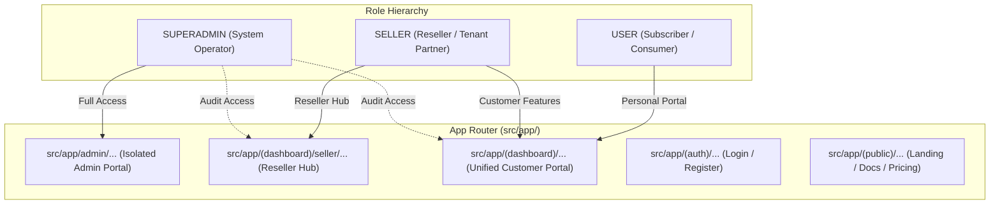

# Enterprise Frontend System Architecture & Tri-Role Design

**Platform:** GoVPN Enterprise Cloud Web Client  
**Engine:** Next.js 16 (App Router, Turbopack, Streaming SSR), React 19, Bun 1.4+, Tailwind CSS v4  
**Design Standard:** Cobalt Tactical Dark System & 100% Shadcn UI Primitives  
**Architect:** Senior Next.js / React Architect & Lead CTO  
**Document Status:** Approved Single Source of Truth (SSOT)

---

## 1. Architectural Philosophy & Guiding Principles

The GoVPN frontend is architected as an **Enterprise Modular Monolith (Domain-Driven Design)** that interfaces with 388 modern Go REST endpoints. It is engineered to satisfy five non-negotiable architectural mandates:

1. **Zero-Slop Modularity:** Complete segregation of business logic (`src/modules/`), routing/SEO wrappers (`src/app/`), and shared UI primitives (`src/components/ui/`).
2. **Tri-Role Multi-Tenant Clean Architecture:** Strict, maintainable folder separation between `USER` (End-Consumer), `SELLER` (Reseller / Tenant Distributor), and `ADMIN` (Superadmin Operator).
3. **0ms Edge Security (Defense-in-Depth):** Next.js 16 Edge runtime proxy (`src/proxy.ts`) eliminating Flash of Unauthenticated Content (FOUC) and enforcing Role-Based Access Control (RBAC) before page rendering.
4. **Component Standardization (Shadcn UI):** 100% utilization of the 51 standardized Shadcn UI primitives built on `@base-ui/react`, guaranteeing zero CSS conflicts and accessible ARIA compliance.
5. **Ultra-Fast Performance & Memory Safety:** Virtualized data rendering (`@tanstack/react-virtual`), zero build freezes, and explicit Cumulative Layout Shift elimination ($\text{CLS} = 0$).

---

## 2. Tri-Role Architecture Strategy (`USER` vs `SELLER` vs `ADMIN`)

One of the most frequent architectural failures in SaaS platforms is "role-spaghetti" — mixing customer forms, reseller quota tables, and superadmin controls into monolithic files filled with messy conditional `if (role === 'ADMIN')` branches.

In GoVPN, we enforce a **Tri-Tier Role Boundary Strategy** across the Routing Layer, the Domain Module Layer, and the Guarding Layer.

### 2.1 Role Hierarchy & Capabilities Matrix



| Layer / Responsibility | `USER` (Customer)             | `SELLER` (Reseller)                  | `ADMIN` (Superadmin)                   |
| :--------------------- | :---------------------------- | :----------------------------------- | :------------------------------------- |
| **App Router Route**   | `src/app/(dashboard)/*`       | `src/app/(dashboard)/seller/*`       | `src/app/admin/*`                      |
| **Layout Shell**       | `DashboardSidebar` & `Header` | Same Dashboard Shell + Reseller Menu | Isolated `AdminSidebar` & Admin Header |
| **Edge Guard**         | `hide-jwt` present            | `hide-jwt` + Role `SELLER` or higher | `hide-jwt` + Role `SUPERADMIN` only    |
| **Domain Views**       | `modules/<feature>/views/`    | `modules/<feature>/views/seller/`    | `modules/<feature>/views/admin/`       |
| **API Endpoints**      | `/api/<feature>`              | `/api/seller/<feature>`              | `/api/admin/<feature>`                 |
| **Data Scope**         | Own accounts & invoices       | Tenant sub-users, wholesale quota    | Global fleet, ledger, 40 cron tasks    |

---

## 3. Directory Anatomy & Folder Structure (Production Grade)

```
fontgovpn/
├── docs/                                  # Official Architecture, PRD, Styleguide
│   ├── prd.md                             # Product Requirements Document
│   ├── architecture.md                    # This system architecture blueprint
│   ├── coding-standards.md                # Style format & component guidelines
│   ├── design.md                          # UI/UX Specification & Color Tokens
│   └── plan/                              # Phase execution records
├── public/                                # Static assets (favicons, logos, flags)
└── src/
    ├── app/                               # Next.js 16 App Router (Thin Route Wrappers)
    │   ├── (auth)/                        # Authentication Route Group
    │   │   ├── login/page.tsx             # Member login
    │   │   └── register/page.tsx          # Account registration
    │   ├── (dashboard)/                   # Unified Member & Reseller Route Group
    │   │   ├── layout.tsx                 # Dashboard Shell (Sidebar + Header + Breadcrumbs)
    │   │   ├── dashboard/page.tsx         # User overview & quick stats
    │   │   ├── vpn/
    │   │   │   └── [protocol]/page.tsx    # SSH, VMess, VLess, Trojan, WireGuard
    │   │   ├── servers/page.tsx           # Live server node fleet
    │   │   ├── monitor/page.tsx           # Real-time node telemetry & ping
    │   │   ├── billing/
    │   │   │   ├── invoices/page.tsx      # Invoices & billing ledger
    │   │   │   └── deposit/page.tsx       # QRIS / VA deposit flow
    │   │   ├── dns/page.tsx               # Cloudflare DNS zone management
    │   │   ├── ai/page.tsx                # AI Gateway & chat playground
    │   │   ├── k8s/page.tsx               # Kubernetes container micro-apps
    │   │   ├── subscription/page.tsx      # Subscription tiers & checkout
    │   │   ├── support/page.tsx           # Support tickets & live replies
    │   │   ├── settings/page.tsx          # Profile & security settings
    │   │   └── seller/                    # 🚀 Dedicated Reseller Hub (Role: SELLER)
    │   │       ├── dashboard/page.tsx     # Reseller metrics, revenue, quota usage
    │   │       ├── tenants/page.tsx       # Sub-tenant client management
    │   │       ├── subscriptions/page.tsx # Wholesale quota allocation
    │   │       ├── pricing/page.tsx       # Custom end-user pricing margins
    │   │       └── withdrawal/page.tsx    # Reseller commission cashout
    │   ├── (public)/                      # Public Marketing Route Group
    │   │   ├── layout.tsx                 # Public Navbar & Footer
    │   │   ├── page.tsx                   # Landing page
    │   │   ├── pricing/page.tsx           # Public pricing comparison
    │   │   └── docs/page.tsx              # Setup guides per OS (Android, iOS, Win)
    │   ├── admin/                         # 🛡️ Superadmin Portal (Role: SUPERADMIN)
    │   │   ├── layout.tsx                 # Red/Cobalt Admin Shell & AdminSidebar
    │   │   ├── dashboard/page.tsx         # System-wide metrics & infrastructure load
    │   │   ├── servers/page.tsx           # Global server node CRUD
    │   │   ├── users/page.tsx             # User management, balance adjustment, bans
    │   │   ├── finance/page.tsx           # Financial ledger, invoices, payout approval
    │   │   ├── cron/page.tsx              # 40 Automated Cron Task Trigger Portal
    │   │   └── k8s/page.tsx               # Cluster nodes, specs, and templates
    │   ├── globals.css                    # Tailwind CSS v4 & Cobalt Tactical Tokens
    │   ├── layout.tsx                     # Root HTML layout with providers
    │   ├── providers.tsx                  # ThemeProvider, I18nProvider, Toaster
    │   └── proxy.ts                       # Next.js 16 Edge runtime security proxy
    │
    ├── components/                        # Shared UI Library Across Modules
    │   ├── ui/                            # 100% Full Suite of 51 Shadcn UI Primitives
    │   │   ├── button.tsx, card.tsx, dialog.tsx, dropdown-menu.tsx, input.tsx,
    │   │   ├── table.tsx, tabs.tsx, sheet.tsx, badge.tsx, tooltip.tsx, ... (51 total)
    │   ├── shared/                        # Domain-Agnostic VPN & Dashboard Atoms
    │   │   ├── CopyButton.tsx             # 1-click clipboard copy with Sonner toast
    │   │   ├── QrCodeModal.tsx            # High-contrast QR renderer for VPN apps
    │   │   ├── ServerPingBadge.tsx        # Latency indicator (<50ms, <120ms, >120ms)
    │   │   ├── ProtocolBadge.tsx          # Protocol brand badges (SSH, VLess, VMess, etc.)
    │   │   ├── StatusBadge.tsx            # Standardized status tags (ACTIVE, PAID, EXPIRED)
    │   │   └── EmptyState.tsx             # Clean zero-data visual placeholders
    │   └── layout/                        # Layout Shell Components & Route Guards
    │       ├── DashboardSidebar.tsx       # Customer & Reseller navigation tree
    │       ├── DashboardHeader.tsx        # Wallet balance, breadcrumbs, search, profile
    │       ├── AdminSidebar.tsx           # Superadmin navigation menu
    │       ├── PublicNavbar.tsx           # Marketing header
    │       ├── PublicFooter.tsx           # Marketing footer
    │       └── shared/                    # Client-side React Route Guards
    │           ├── MemberRouteGuard.tsx   # Enforces active session
    │           ├── SellerRouteGuard.tsx   # Enforces ROLE_SELLER / ROLE_SUPERADMIN
    │           └── AdminRouteGuard.tsx    # Enforces ROLE_SUPERADMIN
    │
    ├── lib/                               # Core Infrastructure & Low-Level Utilities
    │   ├── api/                           # Central HTTP client & envelope decoding
    │   │   └── http-client.ts             # Universal Go REST client with deduplication
    │   ├── config/                        # Runtime environment configurations
    │   │   └── env.ts                     # Zod-validated environment variables
    │   ├── storage/                       # Session storage abstractions
    │   │   └── cookies.ts                 # HttpOnly cookie reader/writer (`hide-jwt`)
    │   ├── i18n/                          # Multi-language translation engine
    │   │   ├── context.tsx                # React I18n Context & `useI18n()` hook
    │   │   └── dict.ts                    # English (`en`) & Indonesian (`id`) dictionaries
    │   └── utils.ts                       # `cn()` helper & latency formatting
    │
    └── modules/                           # Domain-Driven Business Modules (Modular Monolith)
        ├── iam/                           # Identity & Access Management (48 routes)
        ├── vpn/                           # Multi-Protocol Tunneling Fleet (83 routes)
        ├── finance/                       # Invoices, QRIS & Balance Ledger (49 routes)
        ├── monitor/                       # Node Telemetry & Latency Polling (7 routes)
        ├── dns/                           # Cloudflare Zone & Record Manager (18 routes)
        ├── ai/                            # AI Gateway, Playground & Wallets (35 routes)
        ├── kubernetes/                    # Pod Containers & Log Streaming (18 routes)
        ├── subscription/                  # Tiered Plans & Reseller Tenancy (40 routes)
        ├── support/                       # Customer Desk & Live Thread Replies (21 routes)
        ├── notification/                  # Broadcasts & Telegram Webhooks (7 routes)
        ├── admin/                         # System Management & Fleet Controls (Part of 02)
        └── cronjob/                       # 40 Automated Tasks Control Engine (40 routes)
```

---

## 4. Pola C: Role-Partitioned Domain Modules (Resmi SSOT)

Untuk seluruh domain bisnis di `src/modules/<domain>/`, sistem mengadopsi standar resmi **Pola C: Role-Partitioned Module**. Pola ini memecah setiap lapisan internal modul berdasarkan aktor peran bisnis: **`user/`**, **`seller/`**, dan **`admin/`**, dengan folder **`shared/`** sebagai penopang atomik bersama.

### 4.1 Cetak Biru Lengkap Anatomi Modul (Contoh: `src/modules/vpn/`)

````
src/modules/vpn/
├── types/                                 # 1. KONTRAK DATA & DTO PER ROLE
│   ├── index.ts                           # Re-export barrel
│   ├── vpn.types.ts                       # Core Entity: VpnAccount, VpnProtocol, ServerNode (Dipakai semua)
│   ├── user.types.ts                      # DTO User: CreateAccountInput, RenewInput, ResetPasswordInput
│   ├── seller.types.ts                    # DTO Seller: BulkCreateInput, ResellerQuota, TenantVpnSummary
│   └── admin.types.ts                     # DTO Admin: ServerNodeCrudDto, PortConfigDto, ProtocolToggleDto
│
├── api/                                   # 2. REST API CLIENT TERPISAH PER ROLE
│   ├── index.ts                           # Ekspor terpadu: export const vpnApi = { user, seller, admin }
│   ├── user.api.ts                        # Endpoints: /api/account-free, /api/vpn-accounts-month, /api/renew
│   ├── seller.api.ts                      # Endpoints: /api/seller/vpn/*, bulk account minting
│   └── admin.api.ts                       # Endpoints: /api/admin/vpn-servers/*, node CRUD, protocol config
│
├── hooks/                                 # 3. STATE & BUSINESS LOGIC HOOKS PER ROLE
│   ├── index.ts                           # Re-export barrel
│   ├── useVpnUser.ts                      # Hook User: fetch akun aktif, create 1 akun, auto-renew
│   ├── useVpnSeller.ts                    # Hook Seller: batch minting, kuota grosir, export CSV
│   └── useVpnAdmin.ts                     # Hook Admin: node health polling, add/edit server VPS, daemon control
│
├── components/                            # 4. KOMPONEN UI BERBASIS SHADCN UI
│   ├── shared/                            # 🟢 Atomik UI yang Dipakai Lintas Role
│   │   ├── ProtocolBadge.tsx              # Badge protokol (SSH, VMess, VLess, Trojan, WireGuard)
│   │   ├── ServerPingBadge.tsx            # Badge latensi ping (<50ms, <120ms, >120ms)
│   │   ├── VpnCredentialsBox.tsx          # Box font-mono berisi Host, Port, UUID, User, Pass
│   │   ├── QrCodeModal.tsx                # Modal QR code scan untuk v2rayNG / Sing-Box
│   │   └── CopyCredentialsButton.tsx      # Tombol 1-click copy dengan toast feedback
│   │
│   ├── user/                              # 👤 Khusus UI Pelanggan Biasa
│   │   ├── VpnAccountCard.tsx             # Kartu akun VPN milik user sendiri
│   │   ├── CreateVpnModal.tsx             # Modal pembuatan akun perorangan (1 akun)
│   │   └── RenewAccountDialog.tsx         # Dialog perpanjang masa aktif akun bulanan
│   │
│   ├── seller/                            # 💼 Khusus UI Reseller
│   │   ├── BulkAccountMintModal.tsx       # Modal cetak banyak akun sekaligus (10-100 akun)
│   │   ├── SellerQuotaProgress.tsx        # Indikator sisa kuota grosir reseller
│   │   ├── SubTenantVpnTable.tsx          # Tabel akun VPN per sub-klien reseller
│   │   └── ExportAccountsButton.tsx       # Ekspor akun ke format TXT/CSV/JSON
│   │
│   └── admin/                             # 🛡️ Khusus UI Superadmin
│       ├── ServerNodeFormModal.tsx        # Form CRUD tambah/edit IP, Domain & Kredensial Server
│       ├── NodePortConfigSheet.tsx        # Konfigurasi port Dropbear, OpenSSH, Stunnel, Xray
│       └── GlobalVpnAccountsTable.tsx     # Tabel virtual (@tanstack/react-virtual) seluruh user
│
└── views/                                 # 5. ENTRY POINT TAMPILAN HALAMAN (COMPOSITE VIEWS)
    ├── user/
    │   ├── VpnProtocolView.tsx            # Rendered on /vpn/[protocol] (User)
    │   └── UserServersView.tsx            # Rendered on /servers (Public server fleet)
    ├── seller/
    │   ├── SellerVpnOverviewView.tsx      # Rendered on /seller/vpn (Reseller hub)
    │   └── SellerBulkMintView.tsx         # Rendered on /seller/vpn/bulk
    └── admin/
        ├── AdminServersView.tsx           # Rendered on /admin/servers
        └── AdminVpnAccountsView.tsx       # Rendered on /admin/vpn

### 4.2 Empat Aturan Emas Pola C (The 4 Golden Rules)

1. **Aturan Ketergantungan Satu Arah (*Downward Dependency Only*):**
   - Komponen `user/`, `seller/`, dan `admin/` **BOLEH** mengimpor dari `shared/`.
   - Komponen `shared/` **DILARANG KERAS** mengimpor apa pun dari folder `user/`, `seller/`, atau `admin/`.
2. **Pencegahan Kebocoran Antar Peran (*No Cross-Role Imports*):**
   - Komponen di dalam `user/` **TIDAK BOLEH** mengimpor dari `admin/` atau `seller/`.
   - Begitu juga sebaliknya: `seller/` tidak boleh mengimpor dari `admin/`.
   - Jika suatu elemen UI dibutuhkan oleh lebih dari satu role, elemen tersebut **WAJIB** dipindahkan ke folder `shared/`.
3. **Pemisahan Kontrak DTO & API Client:**
   - Client API tidak digabung menjadi satu file raksasa. Masing-masing peran memiliki file `.api.ts` sendiri (`user.api.ts`, `seller.api.ts`, `admin.api.ts`) yang kemudian diekspor rapi melalui `api/index.ts`.
4. **Thin App Router Boundary:**
   - Berkas di `src/app/` tidak boleh memproses state atau memanggil HTTP client secara langsung. Berkas `page.tsx` hanya bertugas menyetel metadata SEO, menerapkan Route Guard (`<AdminRouteGuard>` / `<SellerRouteGuard>`), dan me-render View terkait.

### 4.3 Penerapan Pola C Lintas Seluruh Modul GoVPN

| Modul Bisnis | Lingkup `user/` | Lingkup `seller/` | Lingkup `admin/` | Lingkup `shared/` |
| :--- | :--- | :--- | :--- | :--- |
| **`vpn`** | Buat 1 akun, renew, QR scan | Cetak grosir, kuota reseller, ekspor CSV | Server VPS CRUD, daemon control, port config | ProtocolBadge, PingBadge, CopyButton |
| **`finance`** | Invoice pribadi, deposit QRIS | Saldo komisi, request payout komisi | Approval payout bank, audit ledger global | QrisCard, InvoiceTable, StatusBadge |
| **`subscription`** | Lihat paket, upgrade langganan | Alokasi sub-tenant, margin harga reseller | Plan pricing CRUD, toggle promo paket | PricingMatrix, TierBadge |
| **`support`** | Buat tiket bantuan, kirim pesan | Tiket prioritas reseller | Penugasan CS, close ticket, resolve ticket | TicketThread, PriorityBadge |
| **`kubernetes`** | Deploy micro-app dari template | Quota pod reseller | Server K8s CRUD, template app CRUD | PodStatusBadge, LogDrawer |

---

## 5. Security & Multi-Tier Route Guard Architecture

```mermaid
sequenceDiagram
    autonumber
    actor Client as User / Browser
    participant Edge as Edge Proxy (src/proxy.ts)
    participant Layout as Root / Role Layout
    participant Guard as React Client Guard
    participant View as Module View
    participant API as Go Backend (388 Endpoints)

    Client->>Edge: GET /admin/servers
    Note over Edge: Checks "hide-jwt" & "govpn_user_role"
    alt No Token Found
        Edge-->>Client: 302 Redirect to /login?from=/admin/servers (0ms FOUC)
    else Role is "USER" (Forbidden)
        Edge-->>Client: 302 Redirect to /dashboard (Access Denied)
    else Role is "SUPERADMIN"
        Edge-->>Layout: 200 OK -> Forward Request
        Layout->>Guard: Render <AdminRouteGuard>
        Guard->>View: Render AdminServersView
        View->>API: GET /api/admin/servers (Bearer JWT)
        API-->>View: 200 { success: true, payload: [...] }
        View-->>Client: Complete Interactive UI (60 FPS)
    end
````

### 5.1 Edge Proxy Implementation (`src/proxy.ts`)

Next.js 16's canonical `proxy.ts` executes at the Cloudflare / Vercel Edge runtime prior to executing any React rendering or RSC streaming. It inspects:

1. `hide-jwt`: Cryptographic session token.
2. `govpn_user_role`: User role (`USER`, `SELLER`, `SUPERADMIN`).

```ts
// Protected route boundaries
const MEMBER_ROUTES = [
  "/dashboard",
  "/vpn",
  "/servers",
  "/billing",
  "/dns",
  "/ai",
  "/k8s",
  "/support",
  "/settings",
];
const SELLER_ROUTES = ["/seller", "/dashboard/seller"];
const ADMIN_ROUTES = ["/admin"];
```

---

## 6. Component Standardization with Shadcn UI (51 Primitives)

To ensure zero visual inconsistency and maintain enterprise design integrity, GoVPN uses **100% of the 51 Shadcn UI components** located in `src/components/ui/`.

### 6.1 Complete Standardized Component Catalog

| Category                  | Standardized Components in `src/components/ui/`                                                                                           |
| :------------------------ | :---------------------------------------------------------------------------------------------------------------------------------------- |
| **Actions & Triggers**    | `button.tsx`, `toggle.tsx`, `toggle-group.tsx`, `context-menu.tsx`, `dropdown-menu.tsx`, `menubar.tsx`                                    |
| **Containers & Surfaces** | `card.tsx`, `sheet.tsx`, `dialog.tsx`, `drawer.tsx`, `popover.tsx`, `collapsible.tsx`, `accordion.tsx`                                    |
| **Form Controls**         | `input.tsx`, `textarea.tsx`, `checkbox.tsx`, `radio-group.tsx`, `select.tsx`, `slider.tsx`, `switch.tsx`, `input-otp.tsx`, `calendar.tsx` |
| **Data Presentation**     | `table.tsx`, `badge.tsx`, `avatar.tsx`, `separator.tsx`, `aspect-ratio.tsx`, `scroll-area.tsx`, `carousel.tsx`, `tabs.tsx`                |
| **Feedback & Status**     | `alert.tsx`, `alert-dialog.tsx`, `progress.tsx`, `skeleton.tsx`, `tooltip.tsx`, `hover-card.tsx`                                          |
| **Navigation & Search**   | `command.tsx`, `breadcrumb.tsx`, `pagination.tsx`, `navigation-menu.tsx`, `sidebar.tsx`                                                   |
| **Visual Charts**         | `chart.tsx` (Recharts integration for latency and bandwidth telemetry)                                                                    |

### 6.2 The Base UI Trigger Convention (`render` vs `asChild`)

Because our Shadcn suite leverages modern `@base-ui/react`:

- In primitives such as `DialogTrigger`, `SheetTrigger`, and `DropdownMenuItem`, use the **`render={<Component ... />}`** prop.
- In `button.tsx`, custom `asChild` support is implemented using `React.cloneElement` to ensure `<Button asChild><Link href="...">...</Link></Button>` renders clean semantic HTML without nested button tags.

### 6.3 Popover & Dropdown Anti-Clipping Mandate

> [!IMPORTANT]
> **Zero Overflow-Hidden on Form Card Wrappers:**
> Shadcn `<Card>` elements include `overflow-hidden` by default. When wrapping inputs that contain floating popovers or dropdown menus (e.g. protocol selectors, country code pickers), you **MUST** pass:
>
> ```tsx
> <Card className="overflow-visible relative z-20 ...">
> ```
>
> This prevents dropdown menus from being clipped by the card container boundaries.

---

## 7. Universal Go REST Envelope & Data Decoding Standard

Every response from the 388 endpoints of the GoVPN Go backend adheres to the universal envelope contract:

$$\text{Envelope} = \{ \text{success}: \mathbb{B},\, \text{message}: \mathbb{S},\, \text{payload} \mid \text{data}: T,\, \text{error}?: \mathbb{S},\, \text{pagination}?: P \}$$

The centralized client `src/lib/api/http-client.ts` automatically decodes both `payload` and `data` properties, injects bearer credentials from `hide-jwt`, deduplicates concurrent in-flight GET requests, and triggers exponential backoff on transient network drops.

---

## 8. Rekayasa Shell Responsif Mobile & Desktop (Modern Web Guidance)

Sesuai standar `modern-web-guidance`, antarmuka GoVPN dirancang untuk memberikan pengalaman navigasi mulus baik pada smartphone (layar 375px–430px), tablet, laptop, hingga monitor ultrawide:

### 8.1 Matriks Breakpoint & Adaptasi Layout

| Breakpoint Tailwind           | Rentang Layar       | Adaptasi Navigasi & Shell                                                                                         | Perilaku Komponen Data                                                                                                      |
| :---------------------------- | :------------------ | :---------------------------------------------------------------------------------------------------------------- | :-------------------------------------------------------------------------------------------------------------------------- |
| **Mobile (`< 640px`)**        | 320px – 639px       | `DashboardSidebar` disembunyikan; diakses via menu hamburger `Sheet` (kiri). Header ramping dengan saldo ringkas. | Kartu VPN stacked (1 kolom), tabel bertransisi ke kartu mobile, tombol aksi berukuran $\ge 44\text{px}$ (_touch-friendly_). |
| **Tablet (`md: 768px`)**      | 640px – 1023px      | Sidebar dapat diciutkan (_collapsible_); breadcrumbs mulai ditampilkan.                                           | Grid 2 kolom untuk Server Nodes dan kartu protokol VPN.                                                                     |
| **Desktop (`lg: 1024px`)**    | 1024px – 1535px     | Fixed Left Sidebar (lebar 256px), Header penuh dengan Cmd+K search, dropdown profil, dan widget saldo.            | Grid 3 kolom, tabel data lengkap dengan kolom aksi di kanan, dialog popup melayang di tengah layar.                         |
| **Ultrawide (`2xl: 1536px`)** | $\ge 1536\text{px}$ | Shell utama terpusat dengan pembatas `max-w-7xl` agar konten tidak melebar berlebihan (_eye-strain prevention_).  | Grid 4 kolom untuk Telemetri Server dan monitoring beban CPU/RAM.                                                           |

### 8.2 Kaidah Responsif Anti-Slop:

1. **Dynamic Viewport (`min-h-dvh`):** Menjamin seluruh kontainer layout memperhitungkan kemunculan/penutupan address bar mobile browser tanpa memicu lonjakan visual (_zero layout shift_).
2. **Container Queries (`@container`):** Setiap kartu VPN (`VpnAccountCard`) dan node server (`ServerNodeCard`) memiliki kemampuan kalkulasi dimensi berbasis lebar elemennya sendiri, sehingga tata letaknya selalu proporsional baik saat diletakkan di sidebar, modal, maupun grid utama.
3. **Ergonomi Sentuh Jempol (Thumb-Zone Optimization):** Pada smartphone, modal dialog otomatis bertransisi menjadi bottom sheet (`Drawer` via Vaul / `Sheet side="bottom"`) sehingga tombol konfirmasi berada di area bawah yang mudah dijangkau satu tangan.
4. **Scrollbar Gutter (`scrollbar-gutter: stable`):** Menjamin kemunculan data dinamis tidak menggeser lebar viewport horizontal.
