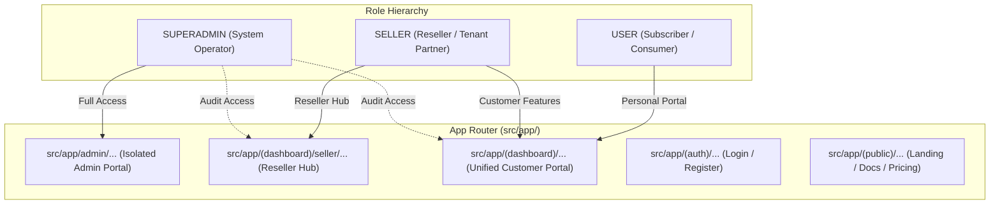
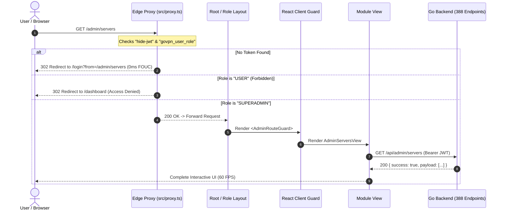

# Enterprise Frontend System Architecture & Tri-Role Design
**Platform:** GoVPN Enterprise Cloud Web Client  
**Engine:** Next.js 16 (App Router, Turbopack, Streaming SSR), React 19, Bun 1.4+, Tailwind CSS v4  
**Design Standard:** Cobalt Tactical Dark System & 100% Shadcn UI Primitives  
**Architect:** Senior Next.js / React Architect & Lead CTO  
**Document Status:** Approved Single Source of Truth (SSOT)  

---

## 1. Architectural Philosophy & Guiding Principles

The GoVPN frontend is architected as an **Enterprise Modular Monolith (Domain-Driven Design)** that interfaces with 388 modern Go REST endpoints. It is engineered to satisfy five non-negotiable architectural mandates:

1. **Zero-Slop Modularity:** Complete segregation of business logic (`src/modules/`), routing/SEO wrappers (`src/app/`), and shared UI primitives (`src/components/ui/`).
2. **Tri-Role Multi-Tenant Clean Architecture:** Strict, maintainable folder separation between `USER` (End-Consumer), `SELLER` (Reseller / Tenant Distributor), and `ADMIN` (Superadmin Operator).
3. **0ms Edge Security (Defense-in-Depth):** Next.js 16 Edge runtime proxy (`src/proxy.ts`) eliminating Flash of Unauthenticated Content (FOUC) and enforcing Role-Based Access Control (RBAC) before page rendering.
4. **Component Standardization (Shadcn UI):** 100% utilization of the 51 standardized Shadcn UI primitives built on `@base-ui/react`, guaranteeing zero CSS conflicts and accessible ARIA compliance.
5. **Ultra-Fast Performance & Memory Safety:** Virtualized data rendering (`@tanstack/react-virtual`), zero build freezes, and explicit Cumulative Layout Shift elimination ($\text{CLS} = 0$).

---

## 2. Tri-Role Architecture Strategy (`USER` vs `SELLER` vs `ADMIN`)

One of the most frequent architectural failures in SaaS platforms is "role-spaghetti" — mixing customer forms, reseller quota tables, and superadmin controls into monolithic files filled with messy conditional `if (role === 'ADMIN')` branches.

In GoVPN, we enforce a **Tri-Tier Role Boundary Strategy** across the Routing Layer, the Domain Module Layer, and the Guarding Layer.

### 2.1 Role Hierarchy & Capabilities Matrix



| Layer / Responsibility | `USER` (Customer) | `SELLER` (Reseller) | `ADMIN` (Superadmin) |
| :--- | :--- | :--- | :--- |
| **App Router Route** | `src/app/(dashboard)/*` | `src/app/(dashboard)/seller/*` | `src/app/admin/*` |
| **Layout Shell** | `DashboardSidebar` & `Header` | Same Dashboard Shell + Reseller Menu | Isolated `AdminSidebar` & Admin Header |
| **Edge Guard** | `hide-jwt` present | `hide-jwt` + Role `SELLER` or higher | `hide-jwt` + Role `SUPERADMIN` only |
| **Domain Views** | `modules/<feature>/views/` | `modules/<feature>/views/seller/` | `modules/<feature>/views/admin/` |
| **API Endpoints** | `/api/<feature>` | `/api/seller/<feature>` | `/api/admin/<feature>` |
| **Data Scope** | Own accounts & invoices | Tenant sub-users, wholesale quota | Global fleet, ledger, 40 cron tasks |

---

## 3. Directory Anatomy & Folder Structure (Production Grade)

```
fontgovpn/
├── docs/                                  # Official Architecture, PRD, Styleguide
│   ├── prd.md                             # Product Requirements Document
│   ├── architecture.md                    # This system architecture blueprint
│   ├── coding-standards.md                # Style format & component guidelines
│   ├── design.md                          # UI/UX Specification & Color Tokens
│   └── plan/                              # Phase execution records
├── public/                                # Static assets (favicons, logos, flags)
└── src/
    ├── app/                               # Next.js 16 App Router (Thin Route Wrappers)
    │   ├── (auth)/                        # Authentication Route Group
    │   │   ├── login/page.tsx             # Member login
    │   │   └── register/page.tsx          # Account registration
    │   ├── (dashboard)/                   # Unified Member & Reseller Route Group
    │   │   ├── layout.tsx                 # Dashboard Shell (Sidebar + Header + Breadcrumbs)
    │   │   ├── dashboard/page.tsx         # User overview & quick stats
    │   │   ├── vpn/
    │   │   │   └── [protocol]/page.tsx    # SSH, VMess, VLess, Trojan, WireGuard
    │   │   ├── servers/page.tsx           # Live server node fleet
    │   │   ├── monitor/page.tsx           # Real-time node telemetry & ping
    │   │   ├── billing/
    │   │   │   ├── invoices/page.tsx      # Invoices & billing ledger
    │   │   │   └── deposit/page.tsx       # QRIS / VA deposit flow
    │   │   ├── dns/page.tsx               # Cloudflare DNS zone management
    │   │   ├── ai/page.tsx                # AI Gateway & chat playground
    │   │   ├── k8s/page.tsx               # Kubernetes container micro-apps
    │   │   ├── subscription/page.tsx      # Subscription tiers & checkout
    │   │   ├── support/page.tsx           # Support tickets & live replies
    │   │   ├── settings/page.tsx          # Profile & security settings
    │   │   └── seller/                    # 🚀 Dedicated Reseller Hub (Role: SELLER)
    │   │       ├── dashboard/page.tsx     # Reseller metrics, revenue, quota usage
    │   │       ├── tenants/page.tsx       # Sub-tenant client management
    │   │       ├── subscriptions/page.tsx # Wholesale quota allocation
    │   │       ├── pricing/page.tsx       # Custom end-user pricing margins
    │   │       └── withdrawal/page.tsx    # Reseller commission cashout
    │   ├── (public)/                      # Public Marketing Route Group
    │   │   ├── layout.tsx                 # Public Navbar & Footer
    │   │   ├── page.tsx                   # Landing page
    │   │   ├── pricing/page.tsx           # Public pricing comparison
    │   │   └── docs/page.tsx              # Setup guides per OS (Android, iOS, Win)
    │   ├── admin/                         # 🛡️ Superadmin Portal (Role: SUPERADMIN)
    │   │   ├── layout.tsx                 # Red/Cobalt Admin Shell & AdminSidebar
    │   │   ├── dashboard/page.tsx         # System-wide metrics & infrastructure load
    │   │   ├── servers/page.tsx           # Global server node CRUD
    │   │   ├── users/page.tsx             # User management, balance adjustment, bans
    │   │   ├── finance/page.tsx           # Financial ledger, invoices, payout approval
    │   │   ├── cron/page.tsx              # 40 Automated Cron Task Trigger Portal
    │   │   └── k8s/page.tsx               # Cluster nodes, specs, and templates
    │   ├── globals.css                    # Tailwind CSS v4 & Cobalt Tactical Tokens
    │   ├── layout.tsx                     # Root HTML layout with providers
    │   ├── providers.tsx                  # ThemeProvider, I18nProvider, Toaster
    │   └── proxy.ts                       # Next.js 16 Edge runtime security proxy
    │
    ├── components/                        # Shared UI Library Across Modules
    │   ├── ui/                            # 100% Full Suite of 51 Shadcn UI Primitives
    │   │   ├── button.tsx, card.tsx, dialog.tsx, dropdown-menu.tsx, input.tsx,
    │   │   ├── table.tsx, tabs.tsx, sheet.tsx, badge.tsx, tooltip.tsx, ... (51 total)
    │   ├── shared/                        # Domain-Agnostic VPN & Dashboard Atoms
    │   │   ├── CopyButton.tsx             # 1-click clipboard copy with Sonner toast
    │   │   ├── QrCodeModal.tsx            # High-contrast QR renderer for VPN apps
    │   │   ├── ServerPingBadge.tsx        # Latency indicator (<50ms, <120ms, >120ms)
    │   │   ├── ProtocolBadge.tsx          # Protocol brand badges (SSH, VLess, VMess, etc.)
    │   │   ├── StatusBadge.tsx            # Standardized status tags (ACTIVE, PAID, EXPIRED)
    │   │   └── EmptyState.tsx             # Clean zero-data visual placeholders
    │   └── layout/                        # Layout Shell Components & Route Guards
    │       ├── DashboardSidebar.tsx       # Customer & Reseller navigation tree
    │       ├── DashboardHeader.tsx        # Wallet balance, breadcrumbs, search, profile
    │       ├── AdminSidebar.tsx           # Superadmin navigation menu
    │       ├── PublicNavbar.tsx           # Marketing header
    │       ├── PublicFooter.tsx           # Marketing footer
    │       └── shared/                    # Client-side React Route Guards
    │           ├── MemberRouteGuard.tsx   # Enforces active session
    │           ├── SellerRouteGuard.tsx   # Enforces ROLE_SELLER / ROLE_SUPERADMIN
    │           └── AdminRouteGuard.tsx    # Enforces ROLE_SUPERADMIN
    │
    ├── lib/                               # Core Infrastructure & Low-Level Utilities
    │   ├── api/                           # Central HTTP client & envelope decoding
    │   │   └── http-client.ts             # Universal Go REST client with deduplication
    │   ├── config/                        # Runtime environment configurations
    │   │   └── env.ts                     # Zod-validated environment variables
    │   ├── storage/                       # Session storage abstractions
    │   │   └── cookies.ts                 # HttpOnly cookie reader/writer (`hide-jwt`)
    │   ├── i18n/                          # Multi-language translation engine
    │   │   ├── context.tsx                # React I18n Context & `useI18n()` hook
    │   │   └── dict.ts                    # English (`en`) & Indonesian (`id`) dictionaries
    │   └── utils.ts                       # `cn()` helper & latency formatting
    │
    └── modules/                           # Domain-Driven Business Modules (Modular Monolith)
        ├── iam/                           # Identity & Access Management (48 routes)
        ├── vpn/                           # Multi-Protocol Tunneling Fleet (83 routes)
        ├── finance/                       # Invoices, QRIS & Balance Ledger (49 routes)
        ├── monitor/                       # Node Telemetry & Latency Polling (7 routes)
        ├── dns/                           # Cloudflare Zone & Record Manager (18 routes)
        ├── ai/                            # AI Gateway, Playground & Wallets (35 routes)
        ├── kubernetes/                    # Pod Containers & Log Streaming (18 routes)
        ├── subscription/                  # Tiered Plans & Reseller Tenancy (40 routes)
        ├── support/                       # Customer Desk & Live Thread Replies (21 routes)
        ├── notification/                  # Broadcasts & Telegram Webhooks (7 routes)
        ├── admin/                         # System Management & Fleet Controls (Part of 02)
        └── cronjob/                       # 40 Automated Tasks Control Engine (40 routes)
```

---

## 4. The 5-Layer Pattern in Domain Modules (`src/modules/<feature>/`)

Every single business domain in `src/modules/<domain>/` strictly adheres to a **5-Layer Architecture**:

```
src/modules/<domain>/
├── types/          # 1. Domain Types & DTO Contracts
│   ├── <domain>.types.ts
│   └── <domain>-seller.types.ts           # (Optional) Reseller-specific DTOs
├── api/            # 2. Pure Asynchronous REST API Client
│   └── <domain>.api.ts                    # Exports userApi, sellerApi, adminApi
├── hooks/          # 3. State Management & Lifecycle Hooks
│   ├── use<Domain>.ts                     # Customer state hook
│   └── useSeller<Domain>.ts               # (Optional) Reseller workflow hook
├── components/     # 4. Standardized Shadcn UI Presentation Components
│   ├── <Domain>Card.tsx
│   ├── <Domain>Table.tsx
│   ├── Create<Domain>Modal.tsx
│   └── seller/                            # (Optional) Reseller-specific UI components
└── views/          # 5. Composed View Assemblies
    ├── <Domain>View.tsx                   # Customer page view
    ├── seller/Seller<Domain>View.tsx      # Reseller page view
    └── admin/Admin<Domain>View.tsx        # Admin page view
```

### Why this guarantees Infinite Scalability:
1. **Zero Route Bloat:** App Router files (`page.tsx`) remain thin (< 25 lines of code), merely configuring metadata, wrapping with the appropriate Route Guard, and rendering the View.
2. **Effortless Refactoring:** If the backend changes an endpoint contract, modifications are isolated to `types/` and `api/` without touching UI presentation.
3. **Role Isolation without Code Duplication:** A reseller table can reuse the exact same atomic `ServerPingBadge`, `CopyButton`, and `StatusBadge` as the customer card, while maintaining its own separate view and business logic.

---

## 5. Security & Multi-Tier Route Guard Architecture



### 5.1 Edge Proxy Implementation (`src/proxy.ts`)
Next.js 16's canonical `proxy.ts` executes at the Cloudflare / Vercel Edge runtime prior to executing any React rendering or RSC streaming. It inspects:
1. `hide-jwt`: Cryptographic session token.
2. `govpn_user_role`: User role (`USER`, `SELLER`, `SUPERADMIN`).

```ts
// Protected route boundaries
const MEMBER_ROUTES = ["/dashboard", "/vpn", "/servers", "/billing", "/dns", "/ai", "/k8s", "/support", "/settings"];
const SELLER_ROUTES = ["/seller", "/dashboard/seller"];
const ADMIN_ROUTES  = ["/admin"];
```

---

## 6. Component Standardization with Shadcn UI (51 Primitives)

To ensure zero visual inconsistency and maintain enterprise design integrity, GoVPN uses **100% of the 51 Shadcn UI components** located in `src/components/ui/`.

### 6.1 Complete Standardized Component Catalog

| Category | Standardized Components in `src/components/ui/` |
| :--- | :--- |
| **Actions & Triggers** | `button.tsx`, `toggle.tsx`, `toggle-group.tsx`, `context-menu.tsx`, `dropdown-menu.tsx`, `menubar.tsx` |
| **Containers & Surfaces** | `card.tsx`, `sheet.tsx`, `dialog.tsx`, `drawer.tsx`, `popover.tsx`, `collapsible.tsx`, `accordion.tsx` |
| **Form Controls** | `input.tsx`, `textarea.tsx`, `checkbox.tsx`, `radio-group.tsx`, `select.tsx`, `slider.tsx`, `switch.tsx`, `input-otp.tsx`, `calendar.tsx` |
| **Data Presentation** | `table.tsx`, `badge.tsx`, `avatar.tsx`, `separator.tsx`, `aspect-ratio.tsx`, `scroll-area.tsx`, `carousel.tsx`, `tabs.tsx` |
| **Feedback & Status** | `alert.tsx`, `alert-dialog.tsx`, `progress.tsx`, `skeleton.tsx`, `tooltip.tsx`, `hover-card.tsx` |
| **Navigation & Search** | `command.tsx`, `breadcrumb.tsx`, `pagination.tsx`, `navigation-menu.tsx`, `sidebar.tsx` |
| **Visual Charts** | `chart.tsx` (Recharts integration for latency and bandwidth telemetry) |

### 6.2 The Base UI Trigger Convention (`render` vs `asChild`)
Because our Shadcn suite leverages modern `@base-ui/react`:
- In primitives such as `DialogTrigger`, `SheetTrigger`, and `DropdownMenuItem`, use the **`render={<Component ... />}`** prop.
- In `button.tsx`, custom `asChild` support is implemented using `React.cloneElement` to ensure `<Button asChild><Link href="...">...</Link></Button>` renders clean semantic HTML without nested button tags.

### 6.3 Popover & Dropdown Anti-Clipping Mandate
> [!IMPORTANT]
> **Zero Overflow-Hidden on Form Card Wrappers:**
> Shadcn `<Card>` elements include `overflow-hidden` by default. When wrapping inputs that contain floating popovers or dropdown menus (e.g. protocol selectors, country code pickers), you **MUST** pass:
> ```tsx
> <Card className="overflow-visible relative z-20 ...">
> ```
> This prevents dropdown menus from being clipped by the card container boundaries.

---

## 7. Universal Go REST Envelope & Data Decoding Standard

Every response from the 388 endpoints of the GoVPN Go backend adheres to the universal envelope contract:

$$\text{Envelope} = \{ \text{success}: \mathbb{B},\, \text{message}: \mathbb{S},\, \text{payload} \mid \text{data}: T,\, \text{error}?: \mathbb{S},\, \text{pagination}?: P \}$$

The centralized client `src/lib/api/http-client.ts` automatically decodes both `payload` and `data` properties, injects bearer credentials from `hide-jwt`, deduplicates concurrent in-flight GET requests, and triggers exponential backoff on transient network drops.
