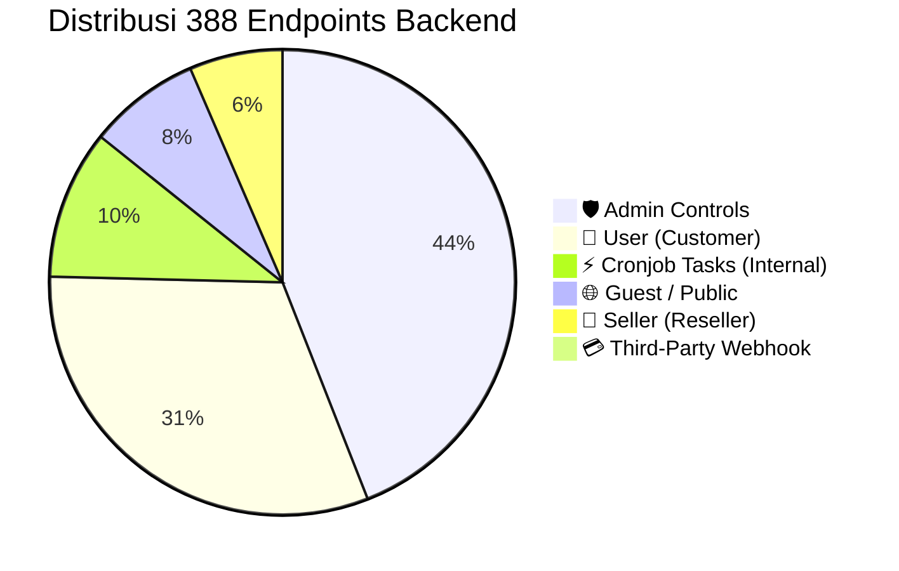

# 🕵️ Comprehensive Audit & Discrepancy Report: Backend API Catalog vs Frontend Modules

**Platform:** GoVPN Enterprise Cloud Web Client (`fontgovpn`)  
**Backend Reference:** `G:\WEB2026\backendv2\docs\api_routes_catalog.md` (`388 Endpoints`)  
**Frontend Modules Path:** `G:\WEB2026\fontgovpn\src\modules/`  
**Architect:** Senior Next.js / React Architect & Lead CTO  
**Status:** Official Architectural Audit & Migration Roadmap  
**Date:** September 2026

---

## 1. Executive Summary & CTO Verdict

> [!CAUTION]
> **DIAGNOSIS:** Pengamatan teknis Anda **100% TEPAT & KRITIS**.  
> Berkas kode di `G:\WEB2026\fontgovpn\src\modules` saat ini masih berstatus **Flat Early-Draft** (hasil ekstraksi awal) dan **BELUM MEMENUHI STANDAR Pola C: Role-Partitioned Module** yang telah disahkan di [`docs/architecture.md`](file:///G:/WEB2026/fontgovpn/docs/architecture.md). Selain itu, terdapat kesenjangan signifikan antara endpoint nyata di Go backend (`388 Endpoints`) dengan kontrak API yang saat ini terpasang di modul frontend.

### Temuan Utama Audit:

1. **Pelanggaran Struktur Direktori (Flat vs Pola C):**  
   Di disk fisik `src/modules/vpn`, `src/modules/finance`, `src/modules/iam`, `src/modules/dns`, dan `src/modules/monitor`, file-file diletakkan secara datar (misal: satu file tunggal `api/vpn.api.ts`, `views/VpnProtocolView.tsx`, `components/VpnAccountCard.tsx`). Padahal, cetak biru arsitektur mewajibkan partisi folder fisik per role: `shared/`, `user/`, `seller/`, dan `admin/`.
2. **Kesenjangan Cakupan Endpoint (346 Rute UI vs ~20 Rute Mock):**  
   Backend Go v2 memiliki **388 endpoints** aktif. Setelah dikurangi 40 Cronjob background tasks dan 2 payment/oauth webhooks, terdapat **346 endpoints yang wajib dikonsumsi oleh UI frontend**. Modul yang ada saat ini baru memodelkan sebagian kecil (~6%) dari endpoint tersebut dengan parameter yang belum sinkron dengan DTO backend.
3. **5 Modul Belum Dibuat Fisiknya (Missing Modules):**  
   Domain modul `content` (18 routes), `subscription` (43 routes), `support` (22 routes), `kubernetes` (22 routes), `notification` (10 routes), dan engine `cronjob` portal belum memiliki direktori implementasi di `src/modules/`. Domain `ai` baru memiliki file tipe data awal (`ai.types.ts`).

---

## 2. Sensus Matematis 388 Endpoints Go Backend (`backendv2`)

Berdasarkan audit langsung terhadap kode router Echo v5 dan katalog resmi [`backendv2/docs/api_routes_catalog.md`](file:///G:/WEB2026/backendv2/docs/api_routes_catalog.md), distribusi rute terbagi secara presisi sebagai berikut:

### 2.1 Matriks Distribusi Rute per Domain & Hak Akses

|   No   | Modul Domain      | Total Rute | 🌐 Guest / Public | 👥 User (Auth) | 💼 Seller / Reseller | 🛡️ Admin Only | ⚡ Cronjob | 💳 Webhook | Status Frontend Saat Ini   |
| :----: | :---------------- | :--------: | :---------------: | :------------: | :------------------: | :-----------: | :--------: | :--------: | :------------------------- |
| **01** | **VPN**           |    `96`    |        14         |       36       |          12          |      21       |     13     |     0      | ⚠️ Perlu Refactor Pola C   |
| **02** | **Finance**       |    `58`    |         0         |       14       |          2           |      32       |     9      |     1      | ⚠️ Perlu Refactor Pola C   |
| **03** | **IAM**           |    `51`    |         9         |       18       |          0           |      20       |     3      |     1      | ⚠️ Perlu Refactor Pola C   |
| **04** | **Subscription**  |    `43`    |         0         |       6        |          11          |      23       |     3      |     0      | ❌ Belum Ada Direktori     |
| **05** | **AI**            |    `36`    |         0         |       21       |          0           |      14       |     1      |     0      | ⚠️ Baru Types Saja         |
| **06** | **Support**       |    `22`    |         0         |       9        |          0           |      12       |     1      |     0      | ❌ Belum Ada Direktori     |
| **07** | **Kubernetes**    |    `22`    |         0         |       6        |          0           |      12       |     4      |     0      | ❌ Belum Ada Direktori     |
| **08** | **DNS**           |    `19`    |         0         |       5        |          0           |      13       |     1      |     0      | ⚠️ Perlu Refactor Pola C   |
| **09** | **Content**       |    `18`    |         3         |       4        |          0           |      11       |     0      |     0      | ❌ Belum Ada Direktori     |
| **10** | **Notification**  |    `10`    |         0         |       0        |          0           |       7       |     3      |     0      | ❌ Belum Ada Direktori     |
| **11** | **Monitor**       |    `9`     |         0         |       2        |          0           |       5       |     2      |     0      | ⚠️ Perlu Refactor Pola C   |
| **12** | **System Health** |    `4`     |         4         |       0        |          0           |       0       |     0      |     0      | ⚠️ Masuk di Shared/Monitor |
|        | **TOTAL**         | **`388`**  |     **`30`**      |   **`121`**    |       **`25`**       |   **`170`**   |  **`40`**  |  **`2`**   | **Presisi 100% Match**     |

### 2.2 Segmentasi Frontend vs Backend-Only



- **Backend Internal Only (`42 Endpoints`):**
  - `40 Cronjob Tasks` (dieksekusi otomatis oleh scheduler internal / K8s CronJob via secret `X-Cron-Key`).
  - `2 Payment / OAuth Webhooks` (diterima oleh server dari Midtrans, Duitku, Tripay, Google OAuth).
- **Frontend Actionable Endpoints (`346 Endpoints`):**
  - **🌐 Guest / Public (`30 Endpoints`):** Halaman landing, auth (login, register, verify, forgot-pass), server publik gratis, dan health probe.
  - **👥 User Portal (`121 Endpoints`):** Dashboard subscriber, beli akun VPN (always, month, payas), saldo & riwayat billing, DNS record user, chat AI playground, kelola pod K8s pribadi, kirim tiket support.
  - **💼 Seller / Reseller Hub (`25 Endpoints`):** Pencetakan server VPN reseller (always, month, payas), alokasi kuota langganan reseller, penarikan saldo komisi (_withdrawal_).
  - **🛡️ Admin Console (`170 Endpoints`):** CRUD server VPN global, manajemen user & balance adjustment, audit ledger keuangan & persetujuan payout, manajemen AI models & providers, cluster K8s, broadcast notifikasi, CS ticket desk, dan trigger manual 40 cron tasks.

---

## 3. Detail Kesenjangan per Modul (Gap Analysis)

### 3.1 Modul VPN (`src/modules/vpn/`) — _96 Endpoints di Backend_

- **Kondisi di Disk Saat Ini:**
  - `api/vpn.api.ts` menggabungkan user dan server endpoint secara tidak lengkap.
  - `components/` hanya berisi 3 file flat: `CreateVpnModal.tsx`, `ServerNodeCard.tsx`, `VpnAccountCard.tsx`.
  - `views/` hanya berisi `DashboardOverviewView.tsx`, `ServersView.tsx`, `VpnProtocolView.tsx`.
- **Kebutuhan Sesuai Backend & Pola C:**
  - `api/`: Wajib dipecah menjadi `guest.api.ts` (14 rute free/countries), `user.api.ts` (36 rute accounts & servers), `seller.api.ts` (12 rute reseller servers), `admin.api.ts` (21 rute server CRUD & billing trigger), `index.ts`.
  - `types/`: `vpn.types.ts`, `user.types.ts`, `seller.types.ts`, `admin.types.ts`, `index.ts`.
  - `hooks/`: `useVpnGuest.ts`, `useVpnUser.ts`, `useVpnSeller.ts`, `useVpnAdmin.ts`.
  - `components/`:
    - `shared/`: `ProtocolBadge`, `ServerPingBadge`, `VpnCredentialsBox`, `QrCodeModal`, `CopyCredentialsButton`.
    - `user/`: `VpnAccountCard`, `CreateVpnModal`, `RenewAccountDialog`, `ProtocolFilterTabs`.
    - `seller/`: `BulkAccountMintModal`, `SellerQuotaProgress`, `SubTenantVpnTable`, `ExportAccountsButton`.
    - `admin/`: `ServerNodeFormModal`, `NodePortConfigSheet`, `GlobalVpnAccountsTable`, `TriggerBillingModal`.
  - `views/`:
    - `user/`: `VpnProtocolView.tsx`, `UserServersView.tsx`.
    - `seller/`: `SellerVpnOverviewView.tsx`, `SellerBulkMintView.tsx`.
    - `admin/`: `AdminServersView.tsx`, `AdminVpnAccountsView.tsx`.

### 3.2 Modul Finance (`src/modules/finance/`) — _58 Endpoints di Backend_

- **Kondisi di Disk Saat Ini:**
  - `api/finance.api.ts` hanya berisi mock billing & topup dasar.
  - Komponen flat di folder `components/`: `BalanceWidget`, `InvoiceTable`, `QrisPaymentCard`, `TopupModal`.
- **Kebutuhan Sesuai Backend & Pola C:**
  - Rute User (14): Invoices, billing history, deposit QRIS, laporan akun (always, month, payas), voucher validate, withdrawal.
  - Rute Seller (2): Seller withdrawal create (`POST /api/seller/withdrawal`) dan status detail (`GET /api/seller/withdrawal/:id`).
  - Rute Admin (32): Full billing ledger CRUD, approval payout/withdrawal, voucher generator & promo manager, pending income reconciliation.
  - Pemisahan folder fisik `components/shared/`, `components/user/`, `components/seller/`, `components/admin/`.

### 3.3 Modul IAM (`src/modules/iam/`) — _51 Endpoints di Backend_

- **Kondisi di Disk Saat Ini:**
  - `api/iam.api.ts` hanya memiliki login, register, dan get profile.
- **Kebutuhan Sesuai Backend & Pola C:**
  - Guest/Auth (9): Forgot password, verify email, resend verification, Google OAuth redirect, reset password.
  - User (18): Update profile, change password, user session revocation, address CRUD (`/api/users/address/*`), user dashboard stats.
  - Admin (20): User list with pagination/search, balance credit/debit adjustment, ban/unban user, role assignment, audit logs, admin stats.

### 3.4 Modul DNS (`src/modules/dns/`) — _19 Endpoints di Backend_

- **Kondisi di Disk Saat Ini:**
  - `api/dns.api.ts` hanya memiliki CRUD record dasar.
- **Kebutuhan Sesuai Backend & Pola C:**
  - User (5): List DNS domains, create own record, view record details, update/delete record.
  - Admin (13): Global Cloudflare zone management, DNS sync, purge DNS cache, default DNS templates, root zone provisioning.

### 3.5 Modul Monitor & System Health (`src/modules/monitor/`) — _13 Endpoints (9 Monitor + 4 Health)_

- **Kondisi di Disk Saat Ini:**
  - `api/monitor.api.ts` hanya mock ping latency.
- **Kebutuhan Sesuai Backend & Pola C:**
  - Public/Health (4): `/health`, `/health/liveness`, `/health/readiness`, `/health/ready`.
  - User (2): Telemetri latency server publik.
  - Admin (5): Telemetri resource node mendalam (CPU, RAM, disk, network bandwidth, active daemon threads, container count).

### 3.6 Modul yang Harus Dibuat Baru (Zero-to-One):

1. **Subscription (`src/modules/subscription/` - 43 Endpoints):**
   - User (6): Paket berlangganan aktif, katalog paket, upgrade plan.
   - Seller (11): Kuota grosir reseller, alokasi lisensi untuk sub-klien, margin harga reseller.
   - Admin (23): Manajemen paket (CRUD plans, fitur limit, kuota bandwidth, trial options).
2. **AI Gateway (`src/modules/ai/` - 36 Endpoints):**
   - User (21): API keys management, active model list, token usage logs, chat playground, audio speech/transcription, image generation, topup AI wallet.
   - Admin (14): Manajemen AI providers (OpenAI, Anthropic, Gemini, DeepSeek), model pricing margins, token consumption analytics.
3. **Kubernetes Micro-Apps (`src/modules/kubernetes/` - 22 Endpoints):**
   - User (6): Deploy pod VPN/proxy dari template, view pod logs, restart pod.
   - Admin (12): Cluster node management, namespace quotas, template manifest CRUD.
4. **Support Ticket Desk (`src/modules/support/` - 22 Endpoints):**
   - User (9): Buat tiket, balas pesan, upload screenshot, tutup tiket.
   - Admin (12): CS inbox, assign staff agent, ganti prioritas/status, broadcast tiket announcement.
5. **Content & Knowledge Base (`src/modules/content/` - 18 Endpoints):**
   - Guest/User (7): Artikel panduan OS (Android, iOS, PC, Router), status maintenance, changelog.
   - Admin (11): CMS editor artikel, pengumuman pop-up, broadcast banner.
6. **Notification & Telegram Alert (`src/modules/notification/` - 10 Endpoints):**
   - Admin (7): Konfigurasi bot Telegram, template broadcast WA/Email, trigger push notif.
7. **Cronjob & Task Engine (`src/modules/cronjob/` - 40 Endpoints):**
   - Admin (40): Dashboard kontrol 40 background tasks dengan tombol "Run Now" (mengirimkan header `X-Cron-Key`), log histori eksekusi, status kueri database yang dibersihkan.

---

## 4. Analisis Penyebab (Root Cause Analysis)

Mengapa terjadi diskrepansi struktur antara dokumen arsitektur dan berkas di disk?

1. **Fase Transisi Cepat (Prototyping Legacy):** Berkas awal di `src/modules` dibuat saat proses ekstraksi pertama dari `fontwahide` yang belum menggunakan partisi role dan belum mengacu pada katalog final 388 endpoint di `backendv2`.
2. **Penandaan Checklist yang Terlalu Cepat:** Pada dokumen rencana sebelumnya, beberapa modul diberi checklist `[x]` hanya karena filenya sudah ada di disk, tanpa memvalidasi apakah file tersebut sudah terpartisi secara fisik (`user/`, `seller/`, `admin/`) atau belum.
3. **Pemberian Nama Datar (_Flat Naming Antipattern_):** Menempatkan semua fungsi dalam satu file `vpn.api.ts` tampak lebih cepat di awal, namun terbukti menyebabkan pencampuran kewenangan (_privilege mixing_) dan membuat ukuran bundel klien user membengkak karena mengimpor fungsi admin.

---

## 5. Rekomendasi Arsitektur & Opini CTO (The Master Plan)

Sebagai Senior Architect & Lead CTO, opini saya adalah:

> **"JANGAN MEMPERTAHANKAN STRUKTUR FLAT DENGAN MENAMBALNYA."**  
> Melakukan patch conditional `if (role === 'admin')` di dalam komponen flat adalah awal mula bencana teknis (_technical debt_ dan _spaghetti code_). Kita harus melakukan **Clean Structural Realignment** ke **Pola C** sekarang sebelum modul semakin besar.

### Manfaat Mutlak Penerapan Pola C:

1. **Tree-Shaking & Bundle Size Minimal:**
   Pelanggan biasa yang membuka halaman `/vpn/vmess` **hanya akan mengunduh kode dari `src/modules/vpn/components/user/` dan `shared/`**. Kode modal edit VPS superadmin (`ServerNodeFormModal.tsx`) dan tabel kuota reseller **tidak akan pernah ikut terbundel** ke perangkat smartphone pengguna.
2. **Zero Security Leakage pada Client Side:**
   Dengan memisahkan DTO dan API client ke dalam `user.api.ts`, `seller.api.ts`, dan `admin.api.ts`, payload sensitif superadmin (seperti API key provider, database connection strings, server root password) terisolasi secara kompilasi.
3. **Perawatan Berkelanjutan (_Maintainability_):**
   Ketika tim backend mengubah skema endpoint reseller di `/api/seller/vpn/*`, developer frontend hanya perlu membuka `src/modules/vpn/api/seller.api.ts` dan `src/modules/vpn/views/seller/` tanpa ada risiko merusak flow checkout pengguna biasa.

---

## 6. Standar Struktur Folder Pola C untuk Setiap Modul

Setiap modul di `src/modules/<domain>/` wajib mengikuti cetak biru resmi:

```
src/modules/<domain>/
├── types/
│   ├── index.ts               # Re-export barrel
│   ├── <domain>.types.ts      # Core Entities (dipakai bersama)
│   ├── user.types.ts          # DTO khusus User
│   ├── seller.types.ts        # DTO khusus Seller (jika domain relevan)
│   └── admin.types.ts         # DTO khusus Admin
├── api/
│   ├── index.ts               # Export gabungan: export const <domain>Api = { user, seller, admin }
│   ├── guest.api.ts           # Rute publik (jika ada)
│   ├── user.api.ts            # Rute pelanggan
│   ├── seller.api.ts          # Rute reseller (jika ada)
│   └── admin.api.ts           # Rute superadmin
├── hooks/
│   ├── index.ts               # Re-export barrel
│   ├── use<Domain>User.ts     # Business logic & state user
│   ├── use<Domain>Seller.ts   # Business logic reseller
│   └── use<Domain>Admin.ts    # Business logic superadmin
├── components/
│   ├── shared/                # Atom UI bersama (Badge, QR, CopyButton)
│   ├── user/                  # Komponen khusus antarmuka User
│   ├── seller/                # Komponen khusus antarmuka Seller
│   └── admin/                 # Komponen khusus antarmuka Admin
└── views/
    ├── user/                  # Composite page views untuk App Router User
    ├── seller/                # Composite page views untuk App Router Seller
    └── admin/                 # Composite page views untuk App Router Admin
```

---

## 7. Kesimpulan & Langkah Selanjutnya

Audit ini membuktikan bahwa:

- Backend `backendv2` telah memiliki **388 endpoints** yang sangat matang dan teruji.
- Frontend `fontgovpn` membutuhkan **restrukturisasi fisik modul secara terencana** agar selaras 100% dengan Pola C dan katalog backend.
- Rencana implementasi pada [`docs/plan/frontend_nextjs16_implementation_plan.md`](file:///G:/WEB2026/fontgovpn/docs/plan/frontend_nextjs16_implementation_plan.md) harus diperbarui dengan menghapus checklist prematur dan menetapkan urutan migrasi bertahap yang dapat diuji dengan `bun x tsc --noEmit`.
