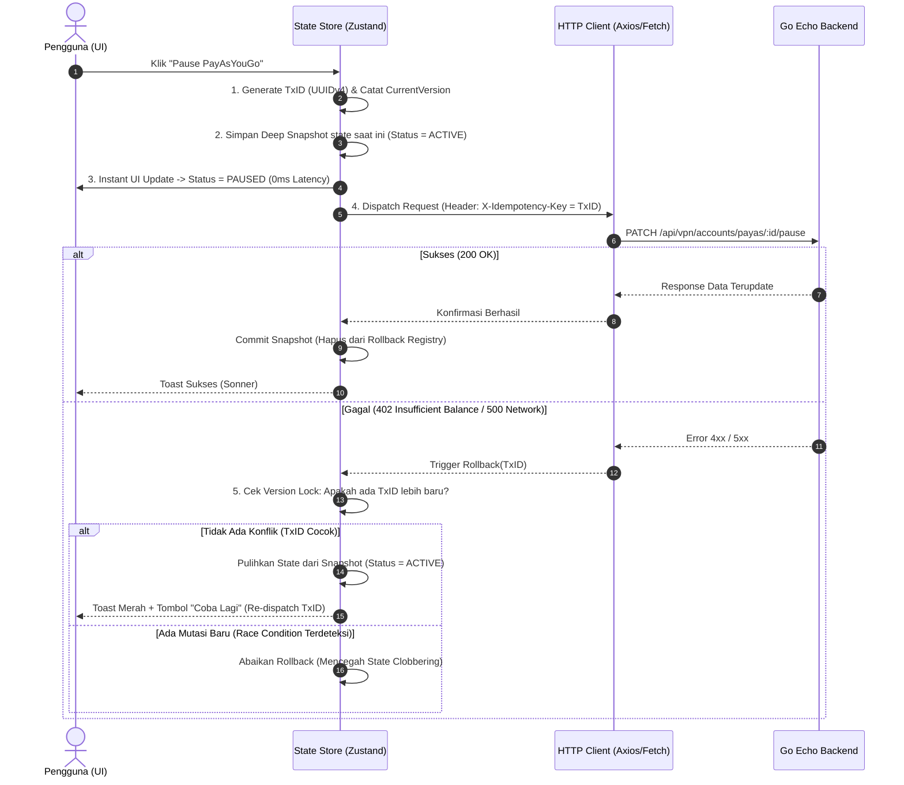

# 📋 Rencana Implementasi: Arsitektur Frontend Next.js 16 Enterprise — GoVPN (`fontgovpn`)

**Project:** GoVPN / HideSSH Web Client  
**Target Path:** `G:\WEB2026\fontgovpn`  
**Target Plan File:** `G:\WEB2026\fontgovpn\docs\plan\frontend_nextjs16_implementation_plan.md`  
**API Specification Source:** `G:\WEB2026\backendv2\docs\api_routes_catalog.md` (388 Endpoints Teruji)  
**Audit Reference:** `G:\WEB2026\fontgovpn\docs\audit_api_routes_discrepancy.md`  
**Design Reference:** `G:\WEB2026\fontgovpn\docs\opendesign.md` (Coinbase High-Trust System)  
**Design Specification:** `G:\WEB2026\fontgovpn\docs\design.md` & `docs/coding-standards.md`  
**Version:** 3.1 (Role-Partitioned Pola C, 388 Route Matrix, Optimistic Queue & Dynamic Island Splitting)

---

## 🎯 1. Tujuan & Ruang Lingkup Arsitektur

1. **Penerapan Pola C: Role-Partitioned Module Secara Fisik:**
   - Seluruh modul di `src/modules/<domain>/` wajib memiliki struktur folder fisik terisolasi: `types/`, `api/`, `hooks/`, `components/` (`shared/`, `user/`, `seller/`, `admin/`), dan `views/` (`user/`, `seller/`, `admin/`).
   - Mencegah _bundle size bloat_ dan kebocoran DTO/privilege admin ke klien pengguna biasa (_tree-shaking friendly_).
2. **Penyelarasan Penuh dengan Standar Desain Coinbase System (`opendesign.md`):**
   - **Primary Brand:** Coinbase Blue (`#0052ff`) dengan hover Light Blue (`#578bfa`).
   - **Dark Surface:** Near-Black (`#0a0b0d`), Dark Card (`#282b31`), dan border halus `rgba(91, 97, 110, 0.2)`.
   - **56px Pill Button:** Seluruh CTA dan tombol aksi utama wajib berbentuk Pill dengan `rounded-full` ($r = 56\text{px}$).
   - **Typography:** Sans modern untuk teks umum dan `JetBrains Mono` (`font-mono`) untuk seluruh data teknis (IP, Port, UUID, Config URI, Saldo IDR).
3. **Penyelarasan 100% dengan 388 Endpoints di `backendv2`:**
   - **346 Frontend Actionable Endpoints:** 30 Guest/Public, 121 User, 25 Seller, 170 Admin.
   - **42 Backend Tasks:** 40 Cronjob tasks + 2 Webhooks.
4. **Proteksi Edge & Tanpa FOUC (0ms Zero Flash):**
   - Validasi sesi berbasis cookie `hide-jwt` pada runtime Edge Next.js 16 (`src/proxy.ts`) sebelum HTML dirender.
5. **Kepatuhan Modern Web Guidance & Rekayasa Performa:**
   - Menggunakan dynamic viewport units (`min-h-dvh`), container queries (`@container`), target sentuh mobile $\ge 44\text{px}$, stabilitas layout shift ($\text{CLS} = 0$).

---

## 🗺️ 2. Pemetaan Modul Domain 1:1 (`backendv2` ⟷ `fontgovpn`)

Sensus matematis 388 endpoints terpetakan secara presisi ke 12 modul domain:

|   No   | Modul Domain      | Total Rute | 🌐 Guest |  👥 User  | 💼 Seller | 🛡️ Admin  | ⚡ Cron  | 💳 Webhook | Lokasi Modul UI (`fontgovpn`)   |
| :----: | :---------------- | :--------: | :------: | :-------: | :-------: | :-------: | :------: | :--------: | :------------------------------ |
| **01** | **VPN**           |    `96`    |    14    |    36     |    12     |    21     |    13    |     0      | `src/modules/vpn/`              |
| **02** | **Finance**       |    `58`    |    0     |    14     |     2     |    32     |    9     |     1      | `src/modules/finance/`          |
| **03** | **IAM**           |    `51`    |    9     |    18     |     0     |    20     |    3     |     1      | `src/modules/iam/`              |
| **04** | **Subscription**  |    `43`    |    0     |     6     |    11     |    23     |    3     |     0      | `src/modules/subscription/`     |
| **05** | **AI**            |    `36`    |    0     |    21     |     0     |    14     |    1     |     0      | `src/modules/ai/`               |
| **06** | **Support**       |    `22`    |    0     |     9     |     0     |    12     |    1     |     0      | `src/modules/support/`          |
| **07** | **Kubernetes**    |    `22`    |    0     |     6     |     0     |    12     |    4     |     0      | `src/modules/kubernetes/`       |
| **08** | **DNS**           |    `19`    |    0     |     5     |     0     |    13     |    1     |     0      | `src/modules/dns/`              |
| **09** | **Content**       |    `18`    |    3     |     4     |     0     |    11     |    0     |     0      | `src/modules/content/`          |
| **10** | **Notification**  |    `10`    |    0     |     0     |     0     |     7     |    3     |     0      | `src/modules/notification/`     |
| **11** | **Monitor**       |    `9`     |    0     |     2     |     0     |     5     |    2     |     0      | `src/modules/monitor/`          |
| **12** | **System Health** |    `4`     |    4     |     0     |     0     |     0     |    0     |     0      | `src/modules/monitor/` (Shared) |
|        | **TOTAL**         | **`388`**  | **`30`** | **`121`** | **`25`**  | **`170`** | **`40`** |  **`2`**   | **12 Modul Terisolasi**         |

---

## ⚡ 3. Algoritma Mutakhir Terintegrasi (Production-Grade & Anti-Bug)

Untuk menjamin performa ultra-cepat tanpa risiko _race conditions_, _hydration error_, atau _state clobbering_, sistem mengimplementasikan dua algoritma inti berikut:

### 3.1 Algoritma 3: Optimistic Mutation dengan Snapshot Rollback & Versioned Idempotency Queue



#### Pencegahan Potensi Bug (Anti-Bug Safeguards):

1. **Pencegahan Race Condition (_State Clobbering_):** Jika user mengklik "Pause" lalu "Resume" secara cepat berturut-turut, respon error dari request pertama dilarang menimpa state dari request kedua. Solusinya, setiap item memiliki `lastTxId: string` dan `version: number`. Rollback hanya dieksekusi jika `failingTxId === item.lastTxId`.
2. **Garansi Idempoten Jaringan:** Menggunakan header `X-Idempotency-Key: <UUIDv4>` yang dikenali oleh middleware Go backend (`idempotencyMiddleware`), memastikan permintaan yang terulang karena retry jaringan tidak membuat duplikasi billing atau aksi ganda.
3. **Penyimpanan Snapshot Terisolasi (_Immutability_):** Snapshot disimpan menggunakan _structured clone_ (bukan _shallow reference_), sehingga perubahan mutasi berikutnya tidak merusak data cadangan pemulihan.

---

### 3.2 Algoritma 4: Dynamic Island Route Splitting pada Thin App Router

Pada Next.js 16 App Router (React 19), seluruh halaman pada `src/app/` adalah **Thin Server Component Wrappers** yang tidak memuat logika bisnis langsung. Untuk mencegah bocornya bundle besar (seperti modul admin atau virtualized table) ke pengguna mobile, sistem menerapkan **Dynamic Island Splitting** dengan batasan streaming yang aman:

```tsx
// Contoh: src/app/(dashboard)/vpn/[protocol]/page.tsx
import { Suspense } from "react";
import dynamic from "next/dynamic";
import { VpnProtocolSkeleton } from "@/modules/vpn/components/shared/VpnProtocolSkeleton";

// 1. Dynamic import di tingkat View Komposit
// Isolasi chunk: Kode view dan sub-komponen terpisah secara fisik dalam file .js terpisah
const VpnProtocolView = dynamic(
  () =>
    import("@/modules/vpn/views/user/VpnProtocolView").then(
      (mod) => mod.VpnProtocolView,
    ),
  {
    // Menggunakan skeleton berdimensi identik untuk garansi CLS = 0
    loading: () => <VpnProtocolSkeleton />,
  },
);

interface PageProps {
  params: Promise<{ protocol: string }>;
}

export default async function Page({ params }: PageProps) {
  const { protocol } = await params;

  return (
    // 2. React 19 Streaming Boundary: SSR langsung merender Skeleton tanpa blocking TTFB
    <Suspense fallback={<VpnProtocolSkeleton />}>
      <VpnProtocolView protocol={protocol} />
    </Suspense>
  );
}
```

#### Pencegahan Potensi Bug (Anti-Bug Safeguards):

1. **Bebas dari Hydration Error (_No Hydration Mismatch_):** Di Next.js App Router, penggunaan opsi `{ ssr: false }` pada Server Component adalah ilegal dan memicu build error fatal. Oleh karena itu, Dynamic Import pada Thin Router **selalu mempertahankan SSR**, sementara komponen interaktif di dalamnya menggunakan direktif `"use client";`.
2. **Dimensi Skeleton Identik ($\text{CLS} = 0$):** `VpnProtocolSkeleton` dirancang memiliki padding, margin, dan grid layout yang presisi 1:1 dengan `VpnProtocolView` aslinya. Hal ini mencegah lonjakan layout visual (_Cumulative Layout Shift_) saat hydration selesai di smartphone.
3. **Isolasi Chunk RBAC:** File view admin (`AdminServersView.tsx`) di-load secara dinamis hanya jika rute `/admin/*` diakses. Klien pengguna reguler tidak akan pernah mengunduh chunk JS milik superadmin.

---

## 🏗️ 4. Tahapan Eksekusi Rinci (Phased Implementation Plan)

### Fase 1: Fondasi Proyek, Desain Sistem & Shadcn UI (✅ SELESAI)

- [x] **1.1 Setup Root & Dependencies:**
  - Next.js 16 App Router, React 19, Bun 1.4+, Tailwind CSS v4.
  - `@tanstack/react-virtual`, `lucide-react`, `sonner`, `next-themes`, `zod`, `zustand`.
- [x] **1.2 Standardisasi Desain Token Coinbase (`globals.css`):**
  - Primary `#0052ff`, hover `#578bfa`, background `#0a0b0d`, card `#282b31`, border `rgba(91,97,110,0.2)`.
  - Tombol Pill 56px (`rounded-full`) di `src/components/ui/button.tsx`.
- [x] **1.3 Suite Komponen Primitif Shadcn UI (`src/components/ui/`):**
  - Terpasang 26+ komponen inti berbasis `@base-ui/react` (Button, Card, Dialog, Input, Table, Tabs, Sheet, Sonner, Dropdown, dll).
- [x] **1.4 Edge Security & Core HTTP Utilities:**
  - `src/proxy.ts` (Next.js 16 Edge runtime guard dengan validasi cookie `hide-jwt`).
  - `src/lib/storage/cookies.ts` (Cookie reader/writer).
  - `src/lib/api/http-client.ts` (Universal Go envelope client, auto retry, deduplication).
- [x] **1.5 Layout Shell Navigasi:**
  - `DashboardSidebar.tsx`, `DashboardHeader.tsx`, `AdminSidebar.tsx`, `PublicNavbar.tsx`, `PublicFooter.tsx`.

---

### Fase 2: Restrukturisasi Fisik Modul Prioritas Tinggi ke Pola C & Algoritma Baru (🚀 SEDANG BERJALAN)

Setiap modul di bawah ini menjalani **migrasi fisik dari struktur flat ke Pola C murni**, dilengkapi dengan store mutasi optimis dan dynamic island wrapper:

#### 2.1 Modul VPN (`src/modules/vpn/`) — _96 Endpoints_

- [ ] **types/**:
  - `vpn.types.ts`: Core protocol entities (`VpnAccount`, `ServerNode`, `ProtocolConfig`).
  - `user.types.ts`: DTO `CreateAccountInput`, `RenewInput`, `PayasPauseInput`.
  - `seller.types.ts`: DTO `SellerServerInput`, `ResellerQuota`, `SubTenantAccount`.
  - `admin.types.ts`: DTO `AdminServerCrudInput`, `PortConfigInput`, `TriggerBillingInput`.
  - `index.ts`: Barrel export.
- [ ] **api/**:
  - `guest.api.ts`: 14 rute free accounts & public countries/server-types.
  - `user.api.ts`: 36 rute accounts (always, month, payas) & servers available.
  - `seller.api.ts`: 12 rute reseller servers CRUD (always, month, payas).
  - `admin.api.ts`: 21 rute superadmin servers CRUD, server connects, payas billing trigger.
  - `index.ts`: `export const vpnApi = { guest, user, seller, admin }`.
- [ ] **store/** (Menerapkan Algoritma 3 - Mutasi Optimis & Rollback):
  - `vpn-user.store.ts`: Zustand store dengan versioned rollback registry untuk aksi jeda/resume payas, perpanjang masa aktif, dan salin kredensial.
- [ ] **hooks/**:
  - `useVpnGuest.ts`: Fetching free servers & countries.
  - `useVpnUser.ts`: Integrasi store optimis dengan `vpnApi.user`.
  - `useVpnSeller.ts`: Reseller server fleet management & bulk minting.
  - `useVpnAdmin.ts`: Server node CRUD & telemetry.
  - `index.ts`: Barrel export.
- [ ] **components/**:
  - `shared/`: `ProtocolBadge.tsx`, `ServerPingBadge.tsx`, `VpnCredentialsBox.tsx`, `QrCodeModal.tsx`, `CopyCredentialsButton.tsx`, `VpnProtocolSkeleton.tsx`.
  - `user/`: `VpnAccountCard.tsx`, `ServerNodeCard.tsx`, `CreateVpnModal.tsx`, `RenewAccountDialog.tsx`.
  - `seller/`: `BulkAccountMintModal.tsx`, `SellerQuotaProgress.tsx`, `SubTenantVpnTable.tsx`.
  - `admin/`: `ServerNodeFormModal.tsx`, `NodePortConfigSheet.tsx`, `GlobalVpnAccountsTable.tsx`.
- [ ] **views/**:
  - `user/`: `VpnProtocolView.tsx`, `UserServersView.tsx`.
  - `seller/`: `SellerVpnOverviewView.tsx`.
  - `admin/`: `AdminServersView.tsx`.
- [ ] **app router binding (Menerapkan Algoritma 4 - Dynamic Island Splitting)**:
  - `src/app/(dashboard)/vpn/[protocol]/page.tsx` ➔ Dynamic island wrapper ke `VpnProtocolView` dengan skeleton.
  - `src/app/(dashboard)/seller/vpn/page.tsx` ➔ Dynamic island wrapper ke `SellerVpnOverviewView`.
  - `src/app/admin/servers/page.tsx` ➔ Dynamic island wrapper ke `AdminServersView`.

#### 2.2 Modul Finance (`src/modules/finance/`) — _58 Endpoints_

- [ ] **types/**: `finance.types.ts`, `user.types.ts`, `seller.types.ts`, `admin.types.ts`, `index.ts`.
- [ ] **api/**:
  - `user.api.ts`: 14 rute invoices, billing history, deposit QRIS, report, voucher validate, withdrawal.
  - `seller.api.ts`: 2 rute seller withdrawal (`POST /api/seller/withdrawal`, `GET /api/seller/withdrawal/:id`).
  - `admin.api.ts`: 32 rute admin billing CRUD, pending income approval/cleanup, voucher CRUD.
  - `index.ts`: `export const financeApi = { user, seller, admin }`.
- [ ] **hooks/**:
  - `useFinanceUser.ts`: Dilengkapi **Adaptive Polling dengan Page Visibility API** untuk pengecekan QRIS lunas.
  - `useFinanceSeller.ts`: Mutasi optimis pengajuan withdrawal saldo komisi reseller.
  - `useFinanceAdmin.ts`: Audit ledger approval.
- [ ] **components/**:
  - `shared/`: `BalanceWidget.tsx`, `TransactionStatusBadge.tsx`, `VoucherInput.tsx`, `InvoiceSkeleton.tsx`.
  - `user/`: `InvoiceTable.tsx`, `QrisPaymentCard.tsx`, `TopupModal.tsx`, `UserWithdrawalModal.tsx`.
  - `seller/`: `SellerCommissionCard.tsx`, `SellerWithdrawalModal.tsx`, `SellerPayoutHistory.tsx`.
  - `admin/`: `AdminBillingTable.tsx`, `AdminVoucherManager.tsx`, `PendingIncomeApprovalModal.tsx`.
- [ ] **views/**:
  - `user/`: `BillingInvoicesView.tsx`, `DepositView.tsx`.
  - `seller/`: `SellerWithdrawalView.tsx`.
  - `admin/`: `AdminFinanceLedgerView.tsx`.
- [ ] **app router binding (Dynamic Island Splitting)**:
  - `src/app/(dashboard)/billing/invoices/page.tsx` ➔ `BillingInvoicesView`.
  - `src/app/(dashboard)/billing/deposit/page.tsx` ➔ `DepositView`.
  - `src/app/(dashboard)/seller/withdrawal/page.tsx` ➔ `SellerWithdrawalView`.
  - `src/app/admin/finance/page.tsx` ➔ `AdminFinanceLedgerView`.

#### 2.3 Modul IAM (`src/modules/iam/`) — _51 Endpoints_

- [ ] **types/**: `iam.types.ts`, `guest.types.ts`, `user.types.ts`, `admin.types.ts`, `index.ts`.
- [ ] **api/**:
  - `guest.api.ts`: 9 rute auth (login, register, forgot-pass, verify-email, Google OAuth).
  - `user.api.ts`: 18 rute user profile, change-password, session revocation, user address CRUD.
  - `admin.api.ts`: 20 rute admin user management, balance adjustment, ban/unban, role permissions.
  - `index.ts`: `export const iamApi = { guest, user, admin }`.
- [ ] **hooks/**: `useAuthGuest.ts`, `useAuthUser.ts`, `useIamAdmin.ts`.
- [ ] **components/**:
  - `shared/`: `UserAvatar.tsx`, `RoleBadge.tsx`.
  - `guest/`: `LoginForm.tsx`, `RegisterForm.tsx`, `ForgotPasswordForm.tsx`, `VerifyEmailCard.tsx`.
  - `user/`: `ProfileSettingsCard.tsx`, `ChangePasswordModal.tsx`, `ActiveSessionsList.tsx`, `AddressManagerCard.tsx`.
  - `admin/`: `AdminUserTable.tsx`, `BalanceAdjustmentModal.tsx`, `UserDetailSheet.tsx`.
- [ ] **views/**:
  - `guest/`: `LoginView.tsx`, `RegisterView.tsx`.
  - `user/`: `UserSettingsView.tsx`.
  - `admin/`: `AdminUsersView.tsx`.

#### 2.4 Modul DNS (`src/modules/dns/`) — _19 Endpoints_

- [ ] **types/**: `dns.types.ts`, `user.types.ts`, `admin.types.ts`, `index.ts`.
- [ ] **api/**:
  - `user.api.ts`: 5 rute user DNS domains & records CRUD.
  - `admin.api.ts`: 13 rute Cloudflare root zones, sync DNS, purge cache.
  - `index.ts`: `export const dnsApi = { user, admin }`.
- [ ] **hooks/**: `useDnsUser.ts` (Optimistic record toggle proxy), `useDnsAdmin.ts`.
- [ ] **components/**:
  - `shared/`: `DnsTypeBadge.tsx`, `ProxyStatusBadge.tsx`.
  - `user/`: `DnsRecordTable.tsx`, `CreateDnsRecordModal.tsx`.
  - `admin/`: `CloudflareZoneTable.tsx`, `SyncDnsModal.tsx`.
- [ ] **views/**: `user/DnsManagerView.tsx`, `admin/AdminDnsZonesView.tsx`.

#### 2.5 Modul Monitor & System Health (`src/modules/monitor/`) — _13 Endpoints_

- [ ] **types/**: `monitor.types.ts`, `user.types.ts`, `admin.types.ts`, `index.ts`.
- [ ] **api/**:
  - `shared.api.ts`: 4 health probe rute (`/health`, `/health/liveness`, `/health/readiness`, `/health/ready`).
  - `user.api.ts`: 2 rute latency telemetri publik.
  - `admin.api.ts`: 5 rute telemetri detail VPS (CPU, RAM, load, active threads).
  - `index.ts`: `export const monitorApi = { shared, user, admin }`.
- [ ] **hooks/**: `useTelemetryUser.ts` (Adaptive polling), `useTelemetryAdmin.ts`.
- [ ] **components/**:
  - `shared/`: `ServerHealthGrid.tsx`, `LatencyChart.tsx`.
  - `admin/`: `NodeHardwareSpecsCard.tsx`, `DaemonProcessList.tsx`.
- [ ] **views/**: `user/ServersMonitorView.tsx`, `admin/AdminClusterHealthView.tsx`.

---

### Fase 3: Pembangunan Modul Baru (Zero-to-One dengan Pola C & Dynamic Islands)

#### 3.1 Modul Subscription (`src/modules/subscription/`) — _43 Endpoints_

- [ ] `types/`: `subscription.types.ts`, `user.types.ts`, `seller.types.ts`, `admin.types.ts`.
- [ ] `api/`: `user.api.ts` (6 rute), `seller.api.ts` (11 rute), `admin.api.ts` (23 rute).
- [ ] `views/`: `user/SubscriptionPlansView.tsx`, `seller/SellerQuotasView.tsx`, `admin/AdminPlansView.tsx`.

#### 3.2 Modul AI Gateway (`src/modules/ai/`) — _36 Endpoints_

- [ ] `types/`: `ai.types.ts`, `user.types.ts`, `admin.types.ts`.
- [ ] `api/`: `user.api.ts` (21 rute chat/keys/wallet), `admin.api.ts` (14 rute model/provider CRUD).
- [ ] `views/`: `user/AiPlaygroundView.tsx`, `user/AiApiKeysView.tsx`, `admin/AdminAiProvidersView.tsx`.

#### 3.3 Modul Support Desk (`src/modules/support/`) — _22 Endpoints_

- [ ] `types/`: `support.types.ts`, `user.types.ts`, `admin.types.ts`.
- [ ] `api/`: `user.api.ts` (9 rute tiket), `admin.api.ts` (12 rute CS desk).
- [ ] `views/`: `user/SupportTicketsView.tsx`, `admin/AdminSupportDeskView.tsx`.

#### 3.4 Modul Kubernetes Micro-Apps (`src/modules/kubernetes/`) — _22 Endpoints_

- [ ] `types/`: `kubernetes.types.ts`, `user.types.ts`, `admin.types.ts`.
- [ ] `api/`: `user.api.ts` (6 rute pod apps), `admin.api.ts` (12 rute k8s cluster).
- [ ] `views/`: `user/K8sDeploymentsView.tsx`, `admin/AdminK8sClusterView.tsx`.

#### 3.5 Modul Content CMS (`src/modules/content/`) — _18 Endpoints_

- [ ] `types/`: `content.types.ts`, `guest.types.ts`, `admin.types.ts`.
- [ ] `api/`: `guest.api.ts` (3 rute), `user.api.ts` (4 rute), `admin.api.ts` (11 rute).
- [ ] `views/`: `guest/DocumentationView.tsx`, `admin/AdminContentCmsView.tsx`.

#### 3.6 Modul Notification (`src/modules/notification/`) — _10 Endpoints_

- [ ] `types/`: `notification.types.ts`, `admin.types.ts`.
- [ ] `api/`: `admin.api.ts` (7 rute broadcast Telegram/Email/Push).
- [ ] `views/`: `admin/AdminNotificationView.tsx`.

#### 3.7 Modul Cronjob Dashboard (`src/modules/cronjob/`) — _40 Endpoints_

- [ ] `types/`: `cronjob.types.ts`.
- [ ] `api/`: `admin.api.ts` (40 rute trigger manual via header `X-Cron-Key`).
- [ ] `views/`: `admin/AdminCronTasksView.tsx`.

---

### Fase 4: Optimasi Performa, Mobile Responsiveness & Static Verification

- [ ] **4.1 Dynamic Viewport Units (`dvh` & `dvw`):**
  - Menggantikan seluruh `100vh` dengan `min-h-dvh` untuk mencegah pergeseran browser bar smartphone.
- [ ] **4.2 Container Queries (`@container`):**
  - Menerapkan `@container` pada `VpnAccountCard`, `ServerNodeCard`, dan widget saldo agar bertransisi mulus dari stacked ke grid.
- [ ] **4.3 Mobile Touch Targets $\ge 44\text{px}$:**
  - Area sentuh tombol, input, switch, dan dropdown minimal $44\times 44\text{px}$.
- [ ] **4.4 Adaptive Overlays:**
  - Floating dialog di desktop ($\ge 768\text{px}$), swipeable bottom sheet di mobile ($< 768\text{px}$).
- [ ] **4.5 TanStack Virtual Scrolling:**
  - Virtualisasi daftar akun dan server untuk performa stabil 60 FPS.
- [ ] **4.6 Static Verification & Anti-Slop:**
  - Eksekusi wajib `bun x tsc --noEmit` untuk menjamin 0 compilation error.
  - Sinkronisasi cabang Git `dev-main` dan `main` pada remote `https://github.com/hidessh99/fontHD.git`.

---

## ⚠️ 5. Aturan Wajib & Larangan Keras AI (AI Hard Rules)

1. **DILARANG KERAS menjalankan `bun run build` atau `next build`** di terminal selama sesi coding! Verifikasi wajib menggunakan static check (`bun x tsc --noEmit`).
2. **Wajib `"use client";`** pada baris pertama di setiap komponen yang menggunakan React hooks.
3. **Dilarang memakai `overflow-hidden`** pada pembungkus Card yang memuat dropdown/selector protokol VPN.
4. **Wajib font `JetBrains Mono`** (`font-mono`) untuk seluruh data teknis (IP, Port, UUID, Config URI).
5. **Dilarang meng-hardcode warna hex sembarangan** (gunakan variabel semantic CSS Coinbase).
6. **Wajib Tombol Pill 56px (`rounded-full`) untuk CTA Utama.**
7. **Wajib Pola C Fisik:** Tidak boleh lagi membuat file API flat seperti `vpn.api.ts` tunggal; wajib memisahkan ke subfolder/file `user.api.ts`, `seller.api.ts`, `admin.api.ts`.
8. **Garansi Anti-Bug Mutasi Optimis:** Setiap mutasi optimis wajib memiliki `TxID` (UUIDv4) dan _version guard_ agar tidak terjadi _state clobbering_ atau _race condition_.
9. **Garansi Anti-Hydration Mismatch:** Dynamic Import pada thin router dilarang memakai `ssr: false` di Server Components; wajib menggunakan Streaming Suspense dengan Skeleton yang cocok dimensi 1:1.
