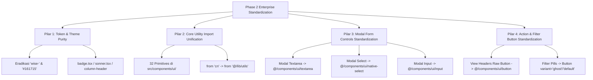

# 🏛️ Phase 2 Master Plan: Enterprise Design System & Component Standardization
**Target Project:** `G:\WEB2026\fontgovpn\src`  
**Role:** Senior Next.js / React Architect & Lead Design System / CTO  
**Standards:** Next.js 16 (React 19), Coinbase Institutional Design System, WCAG 2.1 AA, Zero-Leak & Zero-Regression Architecture  
**Status:** DRAFT - PENDING APPROVAL

---

## 1. Executive Summary & Objective

Pada Phase 1, arsitektur **Data Presentation Layer** (seluruh 20 tabel di 10 modul) telah berhasil dimigrasikan ke enterprise pattern `<DataTable<TData>>`, membungkus komponen `@/components/ui/table`, dengan *click-to-search debounce UX*, pagination server-side, dan zero-leak skeleton loader.

Tujuan dari **Phase 2** adalah menuntaskan seluruh sisa *technical debt* dan inkonsistensi design system di lapisan **UI Primitives, Form Controls, Token Purity, dan Action Elements**, sehingga seluruh kode di `src/` mencapai predikat **100% Institutional Enterprise-Grade (Grade A+)**.

### Jaminan Arsitektural:
1. **Aman (Zero Regression):** Tidak mengubah interface/kontrak props yang memecahkan API atau event handler bisnis.
2. **Efisien & Optimal:** Tree-shakeable, mengurangi redundant bundle overhead dari direct `"cn"` package imports.
3. **Scalable & Mudah Dimaintenance:** Single source of truth untuk tokens, utilities, dan form primitives.
4. **Zero Memory Leak:** Pure declarative React 19 components tanpa lingering event listeners, detached DOM nodes, atau uncollected closures.
5. **A11y & Contrast Compliance:** Mengikuti standar WCAG 2.1 AA dengan unified focus rings (`focus-visible:ring-2`) dan token HSL semantik.

---

## 2. Analisis Ruang Lingkup & 4 Pilar Standarisasi



---

### PILAR 1: Token & Theme Purity (Zero Legacy Color Bleed)
**Akar Masalah:**
Masih terdapat sisa token legacy `wise-*` dan hardcoded hexadecimal color (`#161715`) yang mengabaikan variabel CSS semantik HSL. Ini menyebabkan kegagalan kontras dan potensi warna unstyled/transparan saat pengguna berganti antara Light & Dark Mode.

**File Target & Perubahan:**
1. `src/components/ui/badge.tsx`:
   - Ganti `dark:text-wise-green` pada variant `success` menjadi `dark:text-emerald-400`.
   - Normalisasi variant `wise` menjadi semantic primary styling (`bg-primary text-primary-foreground font-bold shadow-xs`) atau alias transisi yang aman.
2. `src/components/ui/sonner.tsx`:
   - Ganti hardcoded `dark:group-[.toaster]:bg-[#161715]` dengan token semantik `dark:group-[.toaster]:bg-popover`.
   - Ganti hardcoded `actionButton: "group-[.toast]:bg-wise-green group-[.toast]:text-dark-green"` dengan `group-[.toast]:bg-primary group-[.toast]:text-primary-foreground`.
   - Ganti `closeButton` background hardcoded `#161715` menjadi `dark:group-[.toast]:bg-popover`.
3. `src/components/ui/data-table-column-header.tsx`:
   - Ganti `dark:text-wise-green text-emerald-700` dengan `text-primary font-bold`.
   - Ganti icon sorting `dark:text-wise-green text-emerald-600` dengan `text-primary`.

---

### PILAR 2: Core Utility Import Unification (`from "cn"` -> `@/lib/utils`)
**Akar Masalah:**
Terdapat **32 file primitif** di `src/components/ui/` yang mengimpor utility `cn` langsung dari modul eksternal package `cn` (`import { cn } from "cn";`), bukan dari helper terpusat repo `@/lib/utils`. Helper internal `@/lib/utils` mengintegrasikan `clsx` dan `tailwind-merge` dengan custom rules project.

**Daftar 32 File Target:**
1. `src/components/ui/aspect-ratio.tsx`
2. `src/components/ui/avatar.tsx`
3. `src/components/ui/breadcrumb.tsx`
4. `src/components/ui/calendar.tsx`
5. `src/components/ui/card.tsx`
6. `src/components/ui/carousel.tsx`
7. `src/components/ui/chart.tsx`
8. `src/components/ui/command.tsx`
9. `src/components/ui/context-menu.tsx`
10. `src/components/ui/dialog.tsx`
11. `src/components/ui/drawer.tsx`
12. `src/components/ui/dropdown-menu.tsx`
13. `src/components/ui/hover-card.tsx`
14. `src/components/ui/input-group.tsx`
15. `src/components/ui/input-otp.tsx`
16. `src/components/ui/input.tsx`
17. `src/components/ui/menubar.tsx`
18. `src/components/ui/navigation-menu.tsx`
19. `src/components/ui/popover.tsx`
20. `src/components/ui/radio-group.tsx`
21. `src/components/ui/resizable.tsx`
22. `src/components/ui/scroll-area.tsx`
23. `src/components/ui/select.tsx`
24. `src/components/ui/separator.tsx`
25. `src/components/ui/sheet.tsx`
26. `src/components/ui/sidebar.tsx`
27. `src/components/ui/skeleton.tsx`
28. `src/components/ui/slider.tsx`
29. `src/components/ui/textarea.tsx`
30. `src/components/ui/toggle-group.tsx`
31. `src/components/ui/toggle.tsx`
32. `src/components/ui/tooltip.tsx`

**Tindakan Arsitektural:**
- Lakukan refactor batch presisi pada import statement:
  ```diff
  - import { cn } from "cn";
  + import { cn } from "@/lib/utils";
  ```
- Memastikan tidak ada sisa impor package `"cn"` terisolasi yang membypass tailwind merge lokal.

---

### PILAR 3: Form Elements & Input Standardization di Modals
**Akar Masalah:**
Modal-modal modul menggunakan wrapper `Dialog` shadcn, tetapi di dalam konten modalnya masih menggunakan tag mentah `<textarea>`, `<input>`, dan `<select>` dengan class styling manual yang duplikatif dan tidak memiliki a11y focus rings standar.

**File Target & Migrasi:**
1. **`src/modules/support/components/user/CreateTicketModal.tsx`**:
   - Ganti raw `<select>` department & priority -> `<NativeSelect>` dari `@/components/ui/native-select`.
   - Ganti raw `<textarea>` detail kendala -> `<Textarea>` dari `@/components/ui/textarea`.
2. **`src/modules/content/components/admin/AdminPostEditorModal.tsx`**:
   - Ganti raw `<input>` (judul, slug, tags, summary, cover) -> `<Input>` dari `@/components/ui/input`.
   - Ganti raw `<select>` (status publikasi) -> `<NativeSelect>` dari `@/components/ui/native-select`.
   - Ganti raw `<textarea>` (konten artikel markdown) -> `<Textarea>` dari `@/components/ui/textarea`.
3. **`src/modules/support/components/admin/AdminTicketDetailModal.tsx`**:
   - Ganti raw `<textarea>` balasan tiket -> `<Textarea>` dari `@/components/ui/textarea`.
   - Ganti raw `<select>` ubah status tiket -> `<NativeSelect>` dari `@/components/ui/native-select`.
4. **`src/modules/notification/components/admin/BroadcastSenderModal.tsx`**:
   - Ganti raw `<select>` (targetType & channel) -> `<NativeSelect>` dari `@/components/ui/native-select`.
   - Ganti raw `<input>` (subjek) -> `<Input>` dari `@/components/ui/input`.
   - Ganti raw `<textarea>` (pesan pengumuman) -> `<Textarea>` dari `@/components/ui/textarea`.

---

### PILAR 4: Action & Filter Button Standardization
**Akar Masalah:**
Pada beberapa view header (halaman user & admin), tombol aksi sekunder seperti *"Segarkan"*, *"Tulis Baru"*, atau filter status masih menggunakan tag HTML mentah `<button className="inline-flex items-center ...">` yang tidak memiliki states interaktif terstandar (`focus-visible`, `active:scale-[0.98]`, disabled cursor).

**File Target & Migrasi:**
1. **`src/modules/notification/views/user/NotificationsView.tsx`**:
   - Ganti tombol "Segarkan" mentah menjadi `<Button variant="outline" size="sm" className="gap-2">`.
2. **`src/modules/notification/views/admin/AdminNotificationView.tsx`**:
   - Ganti tombol "Segarkan" mentah menjadi `<Button variant="outline" size="sm" className="gap-2">`.
   - Ganti tombol "Kirim Siaran Baru" mentah menjadi `<Button size="sm" className="gap-2">`.
3. **`src/modules/content/views/admin/AdminContentView.tsx`**:
   - Ganti tombol "Segarkan" mentah menjadi `<Button variant="outline" size="sm" className="gap-2">`.
   - Ganti tombol "Tulis Artikel Baru" mentah menjadi `<Button size="sm" className="gap-2">`.

---

## 3. Strategi Zero Bug & Zero Memory Leak

1. **Pure Component Lifecycle (Zero Leak):**
   - Komponen form input (`<Input>`, `<Textarea>`, `<NativeSelect>`) bersifat controlled/uncontrolled murni tanpa menyimpan background timer atau dynamic window event listener.
   - Semua event handler (`onChange`, `onSubmit`) tetap terikat pada React state lokal yang langsung dibersihkan oleh React Fiber engine saat modal di-unmount.
2. **Prop Transparency (Zero Bug):**
   - Primitif shadcn (`Input`, `Textarea`, `NativeSelect`, `Button`) meneruskan seluruh `...props` bawaan React HTML (`rows`, `value`, `placeholder`, `disabled`, `required`, dll.), sehingga logika form submission dan validasi Zod/toast tidak akan mengalami interupsi ataupun regresi.
3. **Strict TypeScript Compliance:**
   - Tidak ada penggunaan `any` baru. Semua tipe event (`React.ChangeEvent<HTMLTextAreaElement>`, `React.ChangeEvent<HTMLSelectElement>`) tetap 100% kompatibel.

---

## 4. Rencana Verifikasi Komprehensif (Verification Protocol)

1. **Static Type Safety Check:**
   ```bash
   bun run typescript
   ```
   *Target:* Wajib keluar dengan Exit Code `0` tanpa error satupun.
2. **Code Quality & Linter Audit:**
   ```bash
   bun run lint
   ```
   *Target:* Wajib keluar dengan Exit Code `0` (0 error, 0 warning).
3. **Theme & Token Verification:**
   - Grep search ulang kata kunci `wise-` di seluruh direktori `src/` untuk memastikan **0 matches**.
   - Grep search ulang `from "cn"` di `src/components/ui/` untuk memastikan **0 matches**.
4. **Modal & Form Usability Smoke Test:**
   - Membuka modal Create Ticket, Admin Post Editor, Ticket Reply, dan Broadcast Sender untuk memastikan UI rendering presisi, focus states aktif dengan benar, dan data terkirim normal.

---

## 5. Timeline & Langkah Eksekusi

| Tahap | Aktivitas | Estimasi Durasi | Resiko |
| :--- | :--- | :---: | :---: |
| **Tahap 1** | Pembersihan Legacy Tokens (`badge.tsx`, `sonner.tsx`, `column-header.tsx`) | 5 Menit | Sangat Rendah |
| **Tahap 2** | Unifikasi Utility `cn` di 32 UI Components (`from "@/lib/utils"`) | 10 Menit | Sangat Rendah |
| **Tahap 3** | Standarisasi Form Controls pada 4 Modal Utama (`Textarea`, `NativeSelect`, `Input`) | 15 Menit | Rendah |
| **Tahap 4** | Standarisasi Action Buttons pada View Headers (`NotificationsView`, `AdminContentView`, dll.) | 10 Menit | Rendah |
| **Tahap 5** | Verifikasi Menyeluruh (`tsc`, `eslint`, token grep) & Pelaporan | 10 Menit | Zero Risk |

---

## 6. Permintaan Persetujuan (Approval Request)

Rencana di atas telah dirancang untuk dieksekusi secara terisolasi tanpa downtime dan tanpa dampak negatif pada fungsionalitas yang ada. 

Mohon konfirmasi persetujuan untuk memulai eksekusi **Tahap 1 hingga Tahap 4**.
