# 🏛️ Phase 3 Master Plan: Final Enterprise Standardization (100% Gold Standard)
**Target Scope:** `G:\WEB2026\fontgovpn\src`  
**Role:** Senior Next.js / React Architect & Lead Design System / CTO  
**Standards:** Next.js 16 (React 19), Coinbase Institutional Design System, WCAG 2.1 AA, Zero-Leak & Zero-Regression Architecture  
**Status:** DRAFT - PENDING APPROVAL

---

## 1. Executive Summary & Objective

Setelah sukses menyelesaikan **Phase 1** (Migrasi 20 Data Table) dan **Phase 2** (Pembersihan Token Lawas `wise-`, Unifikasi 32 file `cn`, dan Standarisasi Form Modal Utama), audit komprehensif mengidentifikasi **10% residual technical debt** yang masih tersisa di codebase.

Tujuan dari **Phase 3** ini adalah mengeksekusi penyempurnaan final untuk mencapai **100% System-Wide Standardization**:
1. **Mengeliminasi 2 Rogue Ad-Hoc Modals (`fixed inset-0`)**: Migrasi total ke shadcn `@/components/ui/dialog`.
2. **Mengeliminasi 7 Raw `<select>` Elements**: Migrasi ke `@/components/ui/native-select` (`<NativeSelect>`).
3. **Standarisasi Tab Navigation di 6 Composite Views**: Migrasi dari tombol array manual ke shadcn `@/components/ui/tabs` (`<Tabs>`, `<TabsList>`, `<TabsTrigger>`).
4. **Standarisasi Header Action Buttons**: Migrasi sisa tombol mentah "Segarkan", "Tambah", dan "Cleanup" ke shadcn `@/components/ui/button`.

### Jaminan Kualitas (Enterprise Guarantees):
- **Zero Bug & Zero Regression:** Kontrak form handlers (`onSubmit`, `onChange`), state management, dan API integration tetap 100% utuh.
- **Zero Memory Leak:** Menggunakan declarative Radix/Base-UI lifecycle dengan unmount cleanup otomatis.
- **100% WCAG 2.1 AA Compliance:** Focus trapping pada modal, keyboard navigation pada tabs (`ArrowLeft`/`ArrowRight`), dan standard accessible focus rings.

---

## 2. Rincian 4 Pilar Eksekusi

```mermaid
graph TD
    A[Phase 3 Final Standardization] --> B[Pilar 1: Eliminasi 2 Ad-Hoc Modals]
    A --> C[Pilar 2: Eliminasi 7 Raw Selects]
    A --> D[Pilar 3: Standarisasi Tabs di 6 Views]
    A --> E[Pilar 4: Standarisasi Header Action Buttons]

    B --> B1[SellerSubscriptionView.tsx]
    B --> B2[AdminSubscriptionView.tsx]

    C --> C1[AiChatPlayground.tsx]
    C --> C2[ServerNodeFormModal.tsx]
    C --> C3[CreateMonitorModal.tsx]
    C --> C4[AdminDomainManager.tsx]
    C --> C5[CreateUserRecordModal.tsx]
    C --> C6[Subscription Seller & Admin Views]

    D --> D1[AdminDnsView.tsx]
    D --> D2[AdminK8sView.tsx]
    D --> D3[AdminContentView.tsx]
    D --> D4[AdminSubscriptionView.tsx]
    D --> D5[AiDashboardView.tsx]
    D --> D6[AdminAiView.tsx]

    E --> E1[SubscriptionPlansView.tsx]
    E --> E2[SupportTicketsView.tsx]
    E --> E3[AdminSupportView.tsx]
```



---

### PILAR 1: Eliminasi Dua (2) Ad-Hoc Modal Overlays
**Masalah:**  
Dua file berikut masih merender modal menggunakan `div fixed inset-0 z-50 bg-background/80 backdrop-blur-sm` tanpa focus trap, tanpa event listener Escape key, dan tanpa semantic ARIA dialog attributes:

1. **`src/modules/subscription/views/seller/SellerSubscriptionView.tsx` (Line 111–178)**
   - **Tindakan:**
     - Bungkus modal provisi langganan dengan `<Dialog open={isProvisionModalOpen} onOpenChange={setIsProvisionModalOpen}>`.
     - Gunakan `<DialogContent className="sm:max-w-md bg-card border-border/60">`, `<DialogHeader>`, `<DialogTitle>`.
     - Ubah raw `<input>` menjadi `<Input>`.
     - Ubah raw `<select>` menjadi `<NativeSelect>`.
     - Ubah tombol Batal/Submit menjadi `<Button variant="outline">` dan `<Button>`.

2. **`src/modules/subscription/views/admin/AdminSubscriptionView.tsx` (Line 172–315)**
   - **Tindakan:**
     - Bungkus modal tambah paket baru dengan `<Dialog open={isAddPlanModalOpen} onOpenChange={setIsAddPlanModalOpen}>`.
     - Gunakan `<DialogContent className="sm:max-w-lg bg-card border-border/60">`, `<DialogHeader>`, `<DialogTitle>`.
     - Ubah seluruh raw `<input>` menjadi `<Input>`.
     - Ubah raw `<select>` billing cycle menjadi `<NativeSelect>`.
     - Ubah tombol Batal/Submit menjadi `<Button variant="outline">` dan `<Button>`.

---

### PILAR 2: Eliminasi Tujuh (7) Raw `<select>` Elements
**Masalah:**  
Dropdown sistem operasi bawaan tidak konsisten secara visual dengan tema dark mode Coinbase Institutional.

**Daftar File & Perubahan ke `<NativeSelect>`:**
1. `src/modules/subscription/views/seller/SellerSubscriptionView.tsx`: Selector paket langganan reseller.
2. `src/modules/subscription/views/admin/AdminSubscriptionView.tsx`: Selector billing cycle paket admin.
3. `src/modules/ai/components/user/AiChatPlayground.tsx` (Line 116):
   - Ganti raw `<select>` model AI aktif menjadi `<NativeSelect size="sm" wrapperClassName="w-auto" className="font-mono text-xs">`.
4. `src/modules/vpn/components/admin/ServerNodeFormModal.tsx` (Line 203):
   - Ganti raw `<select>` tier server (month/always/payas/free) menjadi `<NativeSelect className="font-mono text-xs">`.
5. `src/modules/monitor/components/admin/CreateMonitorModal.tsx` (Line 156):
   - Ganti raw `<select>` interval ping telemetri menjadi `<NativeSelect className="text-xs">`.
6. `src/modules/dns/components/admin/AdminDomainManager.tsx` (Line 144):
   - Ganti raw `<select>` akun Cloudflare menjadi `<NativeSelect className="font-mono text-xs">`.
7. `src/modules/dns/components/user/CreateUserRecordModal.tsx` (Line 115):
   - Ganti raw `<select>` zona domain target menjadi `<NativeSelect className="font-mono text-xs">`.

---

### PILAR 3: Standarisasi Tab Navigation di Enam (6) Composite Views
**Masalah:**  
Tab switching saat ini menggunakan array tombol raw `<button onClick={() => setActiveTab("...")}>` dengan utility styling manual yang redundant dan tidak mendukung navigasi keyboard ARIA.

**Daftar File Target & Migrasi ke Shadcn `<Tabs>`:**
1. `src/modules/dns/views/admin/AdminDnsView.tsx` (Tab: *records*, *domains*, *accounts*)
2. `src/modules/kubernetes/views/admin/AdminK8sView.tsx` (Tab: *servers*, *specs*, *pods*)
3. `src/modules/content/views/admin/AdminContentView.tsx` (Tab: *posts*, *settings*)
4. `src/modules/subscription/views/admin/AdminSubscriptionView.tsx` (Tab: *plans*, *subscriptions*)
5. `src/modules/ai/views/user/AiDashboardView.tsx` (Tab: *keys*, *catalog*, *playground*)
6. `src/modules/ai/views/admin/AdminAiView.tsx` (Tab: *models*, *providers*, *wallets*)

**Pola Transformasi:**
```tsx
// ✅ STANDAR SHADCN TABS DENGAN WAI-ARIA
<Tabs value={activeTab} onValueChange={(val) => setActiveTab(val as any)}>
  <TabsList variant="line" className="border-b border-border/40 w-full justify-start gap-2">
    <TabsTrigger value="tab1">
      <Icon className="h-3.5 w-3.5 mr-1.5" />
      Label 1 ({count1})
    </TabsTrigger>
    <TabsTrigger value="tab2">
      <Icon className="h-3.5 w-3.5 mr-1.5" />
      Label 2 ({count2})
    </TabsTrigger>
  </TabsList>
</Tabs>
```

---

### PILAR 4: Standarisasi Header Action Buttons
**Masalah:**  
Tombol aksi sekunder di view header ditulis dengan tag HTML `<button className="...">` tanpa unified interactive states.

**Daftar File & Migrasi ke `<Button>`:**
1. `src/modules/subscription/views/user/SubscriptionPlansView.tsx` (Line 67):
   - Ganti raw `<button>` "Segarkan Data" -> `<Button variant="outline" size="sm" className="gap-2">`.
2. `src/modules/support/views/user/SupportTicketsView.tsx` (Line 62 & 72):
   - Ganti raw `<button>` "Segarkan" -> `<Button variant="outline" size="sm" className="gap-2">`.
   - Ganti raw `<button>` "Ajukan Tiket Baru" -> `<Button size="sm" className="gap-2">`.
3. `src/modules/support/views/admin/AdminSupportView.tsx` (Line 80 & 90):
   - Ganti raw `<button>` "Segarkan" -> `<Button variant="outline" size="sm" className="gap-2">`.
   - Ganti raw `<button>` "Cleanup Tiket Usang" -> `<Button variant="secondary" size="sm" className="gap-2">`.
4. `src/modules/subscription/views/seller/SellerSubscriptionView.tsx` (Line 73 & 83):
   - Ganti raw tombol "Segarkan" dan "Provisi Langganan Baru" -> `<Button variant="outline" size="sm">` dan `<Button size="sm">`.
5. `src/modules/subscription/views/admin/AdminSubscriptionView.tsx` (Line 95 & 105):
   - Ganti raw tombol "Segarkan" dan "Buat Paket Baru" -> `<Button variant="outline" size="sm">` dan `<Button size="sm">`.

---

## 3. Protokol Verifikasi Zero-Leak & Zero-Bug

1. **TypeScript Type Safety Check:**
   ```bash
   bun run typescript
   ```
   *Target:* Exit code 0, 0 type errors.
2. **ESLint Code Quality Audit:**
   ```bash
   bun run lint
   ```
   *Target:* Exit code 0, 0 warnings, 0 errors.
3. **Pattern Grep Audits:**
   - Verifikasi pencarian `fixed inset-0` di `src/modules/` -> **Wajib 0 matches**.
   - Verifikasi pencarian `<select` di `src/modules/` -> **Wajib 0 matches**.
4. **Smoke Test Usability:**
   - Memastikan modal provisi langganan dan modal tambah paket terbuka dengan animasi mulus, backdrop blur aktif, dan form tersimpan sempurna.
   - Memastikan tab navigasi pada seluruh admin composite views berpindah dengan responsif dan sinkron dengan state URL/konten.

---

## 4. Timeline & Estimasi Eksekusi

| Langkah | Fokus Pekerjaan | Estimasi Waktu |
| :--- | :--- | :---: |
| **Langkah 1** | Migrasi 2 Ad-Hoc Modals ke Shadcn `Dialog` (Seller & Admin Subscription) | 7 Menit |
| **Langkah 2** | Migrasi 7 Raw `<select>` ke Shadcn `<NativeSelect>` | 6 Menit |
| **Langkah 3** | Migrasi Tab Navigation di 6 Composite Views ke Shadcn `<Tabs>` | 8 Menit |
| **Langkah 4** | Migrasi Residual Header Action Buttons ke Shadcn `<Button>` | 4 Menit |
| **Langkah 5** | Verifikasi Menyeluruh (`tsc`, `eslint`, pattern search) & Dokumentasi | 5 Menit |

---

## 5. Permintaan Persetujuan (Approval Request)

Rencana di atas menjamin arsitektur kode di `G:\WEB2026\fontgovpn\src` mencapai **100% Full Institutional Enterprise Grade**. Mohon konfirmasi untuk memulai eksekusi.
