# 🏛️ Phase 4 Plan: 100.0% Purity Gold Standard (Total Perfection)

Dokumen ini mendefinisikan rancangan teknis komprehensif untuk menuntaskan sisa 5% technical debt di seluruh basis kode `G:\WEB2026\fontgovpn\src`. Target akhir fase ini adalah mencapai **100.0% Purity Gold Standard**, di mana tidak ada satu pun elemen UI mentah (raw HTML tag) yang tertinggal di seluruh aplikasi.

---

## 1. Domain & Scope Penugasan

Rencana standarisasi dibagi menjadi **5 Pilar Utama**:

```mermaid
graph TD
  P1[Pilar 1: Form Controls Mentah] --> C1[ContactUsView: NativeSelect & Label]
  P1 --> C2[SubscribeModal & TicketDetail: Checkbox]
  P1 --> C3[TicketChat & ArticlesView: Input]

  P2[Pilar 2: Standarisasi 6 Status Badges] --> B1[TicketStatusBadge & TicketPriorityBadge]
  P2 --> B2[PostStatusBadge & CloudflareProxyBadge]
  P2 --> B3[ChannelBadge & QueueStatusBadge]

  P3[Pilar 3: Public Buttons] --> BT1[ArticlesView: Segarkan]
  P3 --> BT2[ArticleDetailView: Bagikan]

  P4[Pilar 4: Layout Dropdowns] --> D1[PublicNavbar: Protocol Dropdown]
  P4 --> D2[LanguageSwitcher: Popover]

  P5[Pilar 5: Accordion Primitives] --> A1[LandingFaq: shadcn Accordion]
  P5 --> A2[HomeLandingView: shadcn Accordion]
```

---

## 2. Rincian Teknis per Pilar

### 📋 Pilar 1: Eliminasi Raw Form Controls (Selects, Checkboxes, Inputs & Labels)

1. **`src/components/public/ContactUsView.tsx`**:
   - Ganti `<select id="contact-category">` (L401) dengan `<NativeSelect id="contact-category">`.
   - Ganti `<select id="contact-protocol">` (L424) dengan `<NativeSelect id="contact-protocol">`.
   - Ganti `<label>` mentah (L395, L418, L445) dengan `<Label>` dari `@/components/ui/label`.
   - **Benefit:** Chevron konsisten, focus ring tema selaras, label terintegrasi ARIA.

2. **`src/modules/subscription/components/user/SubscribeModal.tsx`**:
   - Ganti `<input type="checkbox">` (L120) dengan `<Checkbox id="auto-renew" checked={autoRenew} onCheckedChange={(v) => setAutoRenew(!!v)} />` dan `<Label htmlFor="auto-renew">`.
   - **Benefit:** Aksesibilitas checkbox, animasi checkmark halus, styling seragam.

3. **`src/modules/support/components/admin/AdminTicketDetailModal.tsx`**:
   - Ganti `<input type="checkbox">` (L219) dengan `<Checkbox id="internal-note" checked={isInternal} onCheckedChange={(v) => setIsInternal(!!v)} />` dan `<Label htmlFor="internal-note">`.
   - **Benefit:** Menggantikan checkbox native browser yang kaku.

4. **`src/modules/support/components/user/TicketConversationView.tsx`**:
   - Ganti `<input type="text">` (L236) pada kolom balasan obrolan tiket dengan `<Input>`.
   - **Benefit:** Styling input selaras dengan seluruh form di aplikasi.

5. **`src/modules/content/views/public/ArticlesView.tsx`**:
   - Ganti `<input type="text">` (L70) pencarian artikel dengan `<Input>` terstandarisasi.
   - **Benefit:** Focus ring dan typography font seragam.

---

### 🏷️ Pilar 2: Unifikasi 6 Status Badges ke Shadcn `<Badge>`

Seluruh komponen status badge berikut akan dimigrasikan dari tag mentah `` menjadi `<Badge variant="outline">` dari `@/components/ui/badge`:

1. **`src/modules/support/components/shared/TicketStatusBadge.tsx`**:
   - `OPEN`: `<Badge variant="outline" className="border-blue-500/30 bg-blue-500/10 text-blue-500 gap-1.5">` + pulse dot.
   - `IN_PROGRESS`: `<Badge variant="outline" className="border-amber-500/30 bg-amber-500/10 text-amber-500 gap-1.5">`.
   - `RESOLVED`: `<Badge variant="outline" className="border-emerald-500/30 bg-emerald-500/10 text-emerald-500 gap-1.5">`.
   - `CLOSED`: `<Badge variant="outline" className="border-zinc-500/30 bg-zinc-500/10 text-zinc-400 gap-1.5">`.

2. **`src/modules/support/components/shared/TicketPriorityBadge.tsx`**:
   - `URGENT`: `<Badge variant="outline" className="border-rose-500/30 bg-rose-500/15 text-rose-500 font-bold text-[10px]">`.
   - `HIGH`: `<Badge variant="outline" className="border-orange-500/30 bg-orange-500/15 text-orange-500 font-bold text-[10px]">`.
   - `MEDIUM`: `<Badge variant="outline" className="border-blue-500/30 bg-blue-500/10 text-blue-400 text-[10px]">`.
   - `LOW`: `<Badge variant="outline" className="border-zinc-500/30 bg-zinc-500/10 text-zinc-400 text-[10px]">`.

3. **`src/modules/content/components/shared/PostStatusBadge.tsx`**:
   - `PUBLISHED`: `<Badge variant="outline" className="border-emerald-500/30 bg-emerald-500/10 text-emerald-500 gap-1.5">`.
   - `DRAFT`: `<Badge variant="outline" className="border-amber-500/30 bg-amber-500/10 text-amber-500 gap-1.5">`.
   - `ARCHIVED`: `<Badge variant="outline" className="border-zinc-500/30 bg-zinc-500/10 text-zinc-400 gap-1.5">`.

4. **`src/modules/dns/components/shared/CloudflareProxyBadge.tsx`**:
   - `PROXIED`: `<Badge variant="outline" className="border-amber-500/30 bg-amber-500/10 text-amber-400 font-mono text-[10px] gap-1.5">` + `<Cloud className="h-3 w-3 fill-amber-400/40" />`.
   - `DNS ONLY`: `<Badge variant="outline" className="border-border bg-muted/40 text-muted-foreground font-mono text-[10px] gap-1.5">` + `<CloudOff className="h-3 w-3" />`.

5. **`src/modules/notification/components/shared/ChannelBadge.tsx`**:
   - Menggunakan `<Badge variant="outline">` dengan ikon `Mail`, `Send`, `MessageSquare`, `Smartphone`, atau `Bell`.

6. **`src/modules/notification/components/shared/QueueStatusBadge.tsx`**:
   - Menggunakan `<Badge variant="outline">` untuk status `SENT`, `PROCESSING`, `PENDING`, `FAILED`, dan `CANCELLED`.

---

### 🔘 Pilar 3: Standarisasi Public Action Buttons

1. **`src/modules/content/views/public/ArticlesView.tsx`** (L54):
   - Ganti tombol "Segarkan" mentah dengan `<Button variant="outline" size="sm" onClick={...} className="gap-2 self-start sm:self-auto">`.
2. **`src/modules/content/views/public/ArticleDetailView.tsx`** (L100):
   - Ganti tombol "Bagikan" mentah dengan `<Button variant="outline" size="sm" onClick={handleShare} className="gap-1.5">`.

---

### 🗂️ Pilar 4: Layout Dropdown Menus (PublicNavbar & LanguageSwitcher)

1. **`src/components/layout/public/PublicNavbar.tsx`** (L90–L121):
   - Migrasi protocol dropdown manual ke `<DropdownMenu>`, `<DropdownMenuTrigger>`, `<DropdownMenuContent>`, `<DropdownMenuItem>`.
   - **Benefit:** Penutupan otomatis saat klik di luar (click outside), penutupan via tombol `Escape`, dan navigasi panah keyboard.
2. **`src/components/layout/shared/LanguageSwitcher.tsx`** (L40–L80):
   - Migrasi popup bahasa manual ke `<DropdownMenu>`, `<DropdownMenuTrigger asChild>`, `<DropdownMenuContent>`, `<DropdownMenuItem>`.
   - **Benefit:** Tidak lagi bergantung pada hover mouse yang rentan flicking di layar sentuh/mobile.

---

### 🪗 Pilar 5: Unifikasi Accordion ke Shadcn Primitive

1. **`src/components/landing/LandingFaq.tsx`**:
   - Ganti state manual `openIndex` dengan shadcn `<Accordion type="single" collapsible defaultValue="item-0">`.
   - Gunakan `<AccordionItem value={...}>`, `<AccordionTrigger>`, `<AccordionContent>`.
2. **`src/components/public/HomeLandingView.tsx`** (L485–L516):
   - Ganti state manual `openFaq` dengan shadcn `<Accordion type="single" collapsible>`.
   - **Benefit:** Memenuhi WAI-ARIA `aria-expanded` otomatis, animasi smooth collapsibility bawaan Base UI.

---

## 3. Rencana Pengujian & Quality Assurance

1. **TypeScript Type Safety:**
   - Jalankan `bun run typescript` (`tsc --noEmit`) -> Target: Exit code 0, 0 errors.
2. **Linting & Code Quality:**
   - Jalankan `bun run lint` (`eslint`) -> Target: Exit code 0, 0 warnings.
3. **Purity Grep Verification:**
   - Pencarian raw `<select` di seluruh `src/` (harus hanya tersisa di internal `native-select.tsx` dan `pagination.tsx`).
   - Pencarian raw `<input type="checkbox"` di seluruh `src/` -> Target: 0 matches.
   - Pencarian raw `<input type="text"` di `src/modules/` -> Target: 0 matches.
