# 🌐 Phase 5 Plan: Complete Enterprise i18n Standardization (EN & ID)

Dokumen ini mendefinisikan arsitektur teknis komprehensif untuk mengintegrasikan sistem lokalisasi **i18n (Internationalization)** di seluruh komponen `G:\WEB2026\fontgovpn\src\components` dan `G:\WEB2026\fontgovpn\src\modules`.

Standar yang diterapkan:
- **Default Locale:** English (`en`)
- **Secondary Locale:** Bahasa Indonesia (`id`)
- **Purity & Reliability:** 100% Zero Error, Zero Missing Translation Keys, Fallback Otomatis ke Default Language (`en`), Zero Memory Leak, dan 100% Type-Safe.

---

## 1. Arsitektur & Strategi Sistem i18n

### 1.1 Struktur Kamus Modular (Namespaces)
Untuk menghindari file terjemahan raksasa yang sulit di-maintain, sistem kamus dibagi ke dalam namespace modular:

```mermaid
graph TD
  Context[I18nProvider / useI18n] --> Fallback[Fallback Engine: Active -> EN -> Key]
  Fallback --> Dicts[Bilingual Dictionaries]
  
  Dicts --> Common[common.json: Buttons, Statuses, Pagination, Modals]
  Dicts --> Nav[nav.json: Admin, Seller, User Sidebars & Headers]
  Dicts --> Dashboard[dashboard.json: Overview, KPI Metrics, Quick Actions]
  Dicts --> Vpn[vpn.json: Protocols, Servers, Account Cards, Credentials]
  Dicts --> Sub[subscription.json: Plans, Billing, Quotas, Modals]
  Dicts --> Dns[dns.json: Domains, Records, Cloudflare, Modals]
  Dicts --> Ai[ai.json: Models, Catalog, Playground, API Keys, Wallet]
  Dicts --> K8s[kubernetes.json: Fleet, Pods, Deployments, Services]
  Dicts --> Mon[monitor.json: Telemetry, Ping, Uptime, Incidents]
  Dicts --> Sup[support.json: Tickets, Chat Thread, Priority, Notes]
  Dicts --> Cont[content.json: Articles, Knowledge Base, Editor]
  Dicts --> Fin[finance.json: Ledger, QRIS Topup, Invoices, Withdrawals]
  Dicts --> Iam[iam.json: Users, Roles, Activity, Password, Profile]
  Dicts --> Notif[notification.json: Channels, Templates, Queue Logs]
  Dicts --> Sell[seller.json: Bulk Minting, Reseller Quota, Payout]
```

### 1.2 Enhanced Fallback Engine (`src/lib/i18n/context.tsx`)
Meningkatkan logika interpolasi dan fallback pada `context.tsx`:
1. Jika teks tidak ditemukan pada `dictionaries[locale][namespace][key]`, sistem secara instan memeriksa `dictionaries['en'][namespace][key]` (English fallback).
2. Jika masih tidak ditemukan, sistem mengembalikan `key` tanpa melempar error / exception runtime.
3. Parametrized string interpolation (`{variable}`) berjalan aman untuk bilangan numerik maupun string.

---

## 2. Rincian Eksekusi per Domain

### 🏛️ Pilar A: Shared UI & Layout (`src/components/`)
1. **`src/components/ui/pagination.tsx`**:
   - Menghilangkan teks hardcoded bahasa Indonesia ("Sebelumnya", "Selanjutnya", "Baris per halaman", "Halaman {page} dari {totalPages}", "dari {totalItems} total").
   - Menjadikan teks bersumber dari `useI18n()` (`common.pagination.*`) dengan nilai default bahasa Inggris yang elegan.
2. **`src/components/shared/`**:
   - `CopyButton.tsx`: Tooltip "Copy" / "Copied" terstandarisasi ke `common.copy` & `common.copied`.
   - `EmptyState.tsx`: Fallback title default ke `common.noData` jika tidak disediakan.
   - `QrCodeModal.tsx`: Header, tombol unduh, dan petunjuk scan menggunakan `common.qrCode`.
   - `data-table/DataTable.tsx` & `DataTableToolbar.tsx`: Search placeholder, clear filters, dan status info menggunakan `common.*`.
3. **Layout Sidebars & Headers**:
   - `AdminSidebar.tsx` & `AdminHeader.tsx`: Grup navigasi dan label menu menggunakan `nav.admin.*`.
   - `DashboardSidebar.tsx` & `DashboardHeader.tsx`: Label navigasi user menggunakan `nav.user.*`.
   - `SellerSidebar.tsx` & `SellerHeader.tsx`: Label navigasi reseller menggunakan `nav.seller.*`.

---

## 3. Rencana Kamus Terjemahan (Bilingual Dictionaries)

Seluruh kunci kamus disusun secara simetris antara English (`locales/en/`) dan Indonesian (`locales/id/`):
- `common.json` (Perluasan elemen umum, pagination, aksi, status)
- `nav.json` (Navigasi Admin, Reseller, Member)
- `dashboard.json` (KPI, Overview, Quick actions)
- `vpn.json` (Perluasan detail VPN & Server)
- `subscription.json` (Plans, Billing, Quotas)
- `dns.json` (Domains, Records, Cloudflare)
- `ai.json` (Models, Playground, API Keys, Tokens)
- `kubernetes.json` (Clusters, Pods, Deployments)
- `monitor.json` (Health metrics, Uptime, Latency)
- `support.json` (Tickets, Priority, Conversations)
- `content.json` (Articles, KB, Markdown Editor)
- `finance.json` (Invoices, QRIS, Ledger, Withdrawals)
- `iam.json` (Users, Roles, Security, Profile)
- `notification.json` (Channels, Templates, Queue)
- `seller.json` (Reseller quota, Bulk minting, Commission)

---

## 4. Jaminan Kualitas & Verifikasi (Zero Bug, Zero Miss)

1. **Parity Checker Script**: Script verifikasi untuk membandingkan kunci JSON antara `en` dan `id` secara rekursif guna memastikan **100% Key Parity**.
2. **TypeScript Strict Type Check**: `bun run typescript` (`tsc --noEmit`) -> Exit code 0, 0 compiler errors.
3. **ESLint Code Quality**: `bun run lint` (`eslint`) -> Exit code 0, 0 lint warnings/errors.
4. **Runtime Verification**: Menguji toggle switch bahasa EN <-> ID pada `LanguageSwitcher` untuk memastikan seluruh UI merespons re-render tanpa lag atau memory leak.
